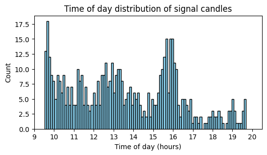
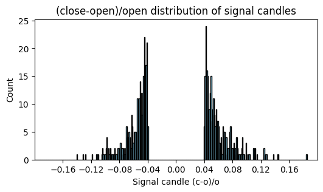
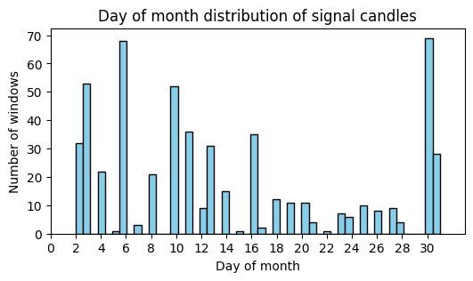
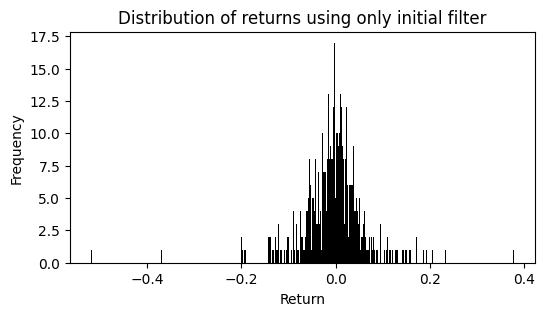
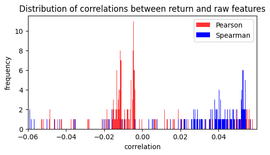

# Trade selection using machine learning and candlestick patterns

## Goal

The goal of this project is to build, compare, and evaluate machine learning models that identify trading opportunities based on historical candlestick data and signal candles. Models are trained and tested over specific periods, and their performance is measured by metrics such as hit rate, mean return, and Sharpe ratio for the selected trades.

## Example run

```
Training set period: 2024-12-30 to 2025-03-20
Test set period: 2025-03-21 to 2025-04-17

Number of trades in training period: 16297
Number of trades in test period: 6866

---------------------------------------------------------

Summary of the top 5 model-selected trading sets, each restricted to contain at least 10 trades.
The ranking is based on mean return.

Model              threshold  n_trades  n_correct  hit_rate  mean_return  sharpe  p_mean  p_hitrate  p_sharpe  
RandomForest          0.8        15        11        0.73      0.0243      0.48    0.100    0.044     0.028      
XGBoost               0.8        13        7         0.54      0.0239      0.45    0.117    0.450     0.048      
ExtraTrees_reg        0.1        14        7         0.50      0.0139      0.08    0.220    0.550     0.372      
FusionModel           0.65       180       119       0.66      0.0126      0.14    0.013    0.000     0.028      
RandomForest          0.6        460       277       0.60      0.0076      0.10    0.015    0.000     0.009      
baseline              --         1229      574       0.47      -0.0018     -0.02   0.770    0.863     0.760
```

## Metric definitions

- **baseline** – strategy that takes all non-overlaping trades
- **threshold** – minimum predicted probability/return to open a trade  
- **n_trades** – number of non-overlaping trades meeting the threshold
- **n_correct** – number of profitable trades  
- **hit_rate** – `n_correct / n_trades`  
- **mean_return** – average return per trade  
- **sharpe** – Sharpe ratio of selected trade returns  
- **p_mean**, **p_hitrate**, **p_sharpe** – p-values from random sampling tests 

## Models

Models tested include:

- **Random Forest** (classifier & regressor)
- **ExtraTrees** (classifier & regressor)
- **XGBoost** (classifier & regressor)
- **MLP** (classifier & regressor)
- **FusionModel** (classifier & regressor) (model using encoders to handle different types of features families)
- **Baseline** (no filter beyond signal candle)


Models ending with `_reg` corresond to regressors that predict continuous returns, while those without `_reg`
are classifiers predicting probabilities of the binary target (positive vs. negative return).

## Statistical significance of the example run

The model with the highest mean return has been chosen among 40 possible (model, threshold) pairs (5 shown in the example). A fair p-value test should mimic this same process, i.e., select the maximum mean return from 40 randomly chosen samples with sizes corresponding to the n_trades of the (model, threshold) pairs. The p-value we got from such a test for this particular run is 0.87, indicating that the top mean return of 0.0243 could very well have been due to chance.

--------------------------------------------
--------------------------------------------
--------------------------------------------
----------------------------------------------------------------------------------------
--------------------------------------------
--------------------------------------------
--------------------------------------------
--------------------------------------------
--------------------------------------------
----------------------------------------------------------------------------------------
--------------------------------------------
--------------------------------------------
--------------------------------------------
--------------------------------------------
--------------------------------------------
--------------------------------------------
--------------------------------------------
----------------------------------------------------------------------------------------
--------------------------------------------
--------------------------------------------
--------------------------------------------
--------------------------------------------
--------------------------------------------
--------------------------------------------
--------------------------------------------
----------------------------------------------------------------------------------------
--------------------------------------------
--------------------------------------------
--------------------------------------------
--------------------------------------------
--------------------------------------------
--------------------------------------------

# Code part

## Content structure
1. Data preparation  
2. Feature engineering 
3. Variable selection (heuristic)
4. Model building and training 
5. Evaluation

## Data

The data consists of candlestick windows, where each candlestick represents one minute. There are 26 candlesticks for each window, where the 21st candlestick is a "signal candle" that is either up more than 4% or down more than -4%. The return for each window is from the opening price of the candle after the signal candle to the closing price of the fifth candle after the signal candle.

The windows were collected for stocks that had satisfied certain daily thresholds for volume, price, and (high-low)/low. For more details on how the windows were collected, see the appendix.

### Load data


```python
import os
import pandas as pd
import numpy as np

folder = "windows"
windows_csv_names = os.listdir(folder)
windows = []

for i, window_name in enumerate(windows_csv_names, start=1):
    w_df = pd.read_csv(os.path.join(folder, window_name))
    ticker = window_name.split('_')[0]
    w_df['ticker'] = ticker
    windows.append(w_df)
    if i % 5000 == 0:
        print(f"{i} / {len(windows_csv_names)} windows loaded")

print(f"Number of windows: {len(windows)}")
```

    5000 / 23163 windows loaded
    10000 / 23163 windows loaded
    15000 / 23163 windows loaded
    20000 / 23163 windows loaded
    Number of windows: 23163
    

### Clean and check data


```python
# Window parameters
N_CANDLES = 26 # Candles per window
N_CANDLES_BEFORE = 20 # Candles before signal candle
N_CANDLES_AFTER = 5 # Candles after signal candle
I_SIGNAL_CANDLE = N_CANDLES_BEFORE # Index signal candle
I_BUY_CANDLE = I_SIGNAL_CANDLE + 1 # Index buy candle
I_SELL_CANDLE = I_SIGNAL_CANDLE + N_CANDLES_AFTER # Index sell candle
SIGNAL_THR = 0.04 # Threshold for absolute value of (c-o)/o for signal candle
```


```python
# Example window
windows[0]
```


<div>
<style scoped>
    .dataframe tbody tr th:only-of-type {
        vertical-align: middle;
    }

    .dataframe tbody tr th {
        vertical-align: top;
    }

    .dataframe thead th {
        text-align: right;
    }
</style>
<table border="1" class="dataframe">
  <thead>
    <tr style="text-align: right;">
      <th></th>
      <th>v</th>
      <th>vw</th>
      <th>o</th>
      <th>c</th>
      <th>h</th>
      <th>l</th>
      <th>t</th>
      <th>n</th>
      <th>ticker</th>
    </tr>
  </thead>
  <tbody>
    <tr>
      <th>0</th>
      <td>16771</td>
      <td>27.7948</td>
      <td>27.755</td>
      <td>27.7900</td>
      <td>27.840</td>
      <td>27.7550</td>
      <td>2025-02-21 15:48:00</td>
      <td>242</td>
      <td>AAOI</td>
    </tr>
    <tr>
      <th>1</th>
      <td>8376</td>
      <td>27.7565</td>
      <td>27.780</td>
      <td>27.7650</td>
      <td>27.790</td>
      <td>27.7100</td>
      <td>2025-02-21 15:49:00</td>
      <td>124</td>
      <td>AAOI</td>
    </tr>
    <tr>
      <th>2</th>
      <td>16524</td>
      <td>27.7511</td>
      <td>27.765</td>
      <td>27.7500</td>
      <td>27.780</td>
      <td>27.7300</td>
      <td>2025-02-21 15:50:00</td>
      <td>221</td>
      <td>AAOI</td>
    </tr>
    <tr>
      <th>3</th>
      <td>17292</td>
      <td>27.7074</td>
      <td>27.745</td>
      <td>27.6900</td>
      <td>27.750</td>
      <td>27.6850</td>
      <td>2025-02-21 15:51:00</td>
      <td>246</td>
      <td>AAOI</td>
    </tr>
    <tr>
      <th>4</th>
      <td>19804</td>
      <td>27.6796</td>
      <td>27.700</td>
      <td>27.6740</td>
      <td>27.710</td>
      <td>27.6500</td>
      <td>2025-02-21 15:52:00</td>
      <td>246</td>
      <td>AAOI</td>
    </tr>
    <tr>
      <th>5</th>
      <td>23903</td>
      <td>27.6273</td>
      <td>27.665</td>
      <td>27.5850</td>
      <td>27.703</td>
      <td>27.5500</td>
      <td>2025-02-21 15:53:00</td>
      <td>250</td>
      <td>AAOI</td>
    </tr>
    <tr>
      <th>6</th>
      <td>43268</td>
      <td>27.5722</td>
      <td>27.575</td>
      <td>27.5750</td>
      <td>27.603</td>
      <td>27.5430</td>
      <td>2025-02-21 15:54:00</td>
      <td>471</td>
      <td>AAOI</td>
    </tr>
    <tr>
      <th>7</th>
      <td>30053</td>
      <td>27.4358</td>
      <td>27.560</td>
      <td>27.3300</td>
      <td>27.560</td>
      <td>27.3300</td>
      <td>2025-02-21 15:55:00</td>
      <td>328</td>
      <td>AAOI</td>
    </tr>
    <tr>
      <th>8</th>
      <td>42423</td>
      <td>27.2484</td>
      <td>27.320</td>
      <td>27.2251</td>
      <td>27.320</td>
      <td>27.1600</td>
      <td>2025-02-21 15:56:00</td>
      <td>513</td>
      <td>AAOI</td>
    </tr>
    <tr>
      <th>9</th>
      <td>46713</td>
      <td>27.2400</td>
      <td>27.235</td>
      <td>27.2900</td>
      <td>27.300</td>
      <td>27.2150</td>
      <td>2025-02-21 15:57:00</td>
      <td>566</td>
      <td>AAOI</td>
    </tr>
    <tr>
      <th>10</th>
      <td>80741</td>
      <td>27.2075</td>
      <td>27.290</td>
      <td>27.1800</td>
      <td>27.290</td>
      <td>27.1600</td>
      <td>2025-02-21 15:58:00</td>
      <td>652</td>
      <td>AAOI</td>
    </tr>
    <tr>
      <th>11</th>
      <td>194777</td>
      <td>27.1017</td>
      <td>27.180</td>
      <td>27.0200</td>
      <td>27.200</td>
      <td>27.0100</td>
      <td>2025-02-21 15:59:00</td>
      <td>965</td>
      <td>AAOI</td>
    </tr>
    <tr>
      <th>12</th>
      <td>41507</td>
      <td>27.0400</td>
      <td>27.040</td>
      <td>27.0400</td>
      <td>27.040</td>
      <td>27.0400</td>
      <td>2025-02-21 16:00:00</td>
      <td>30</td>
      <td>AAOI</td>
    </tr>
    <tr>
      <th>13</th>
      <td>510</td>
      <td>27.0612</td>
      <td>27.060</td>
      <td>27.0600</td>
      <td>27.060</td>
      <td>27.0600</td>
      <td>2025-02-21 16:22:00</td>
      <td>3</td>
      <td>AAOI</td>
    </tr>
    <tr>
      <th>14</th>
      <td>151166</td>
      <td>27.0400</td>
      <td>27.040</td>
      <td>27.0400</td>
      <td>27.040</td>
      <td>27.0400</td>
      <td>2025-02-21 16:35:00</td>
      <td>1</td>
      <td>AAOI</td>
    </tr>
    <tr>
      <th>15</th>
      <td>2357</td>
      <td>27.4399</td>
      <td>27.440</td>
      <td>27.4400</td>
      <td>27.440</td>
      <td>27.4400</td>
      <td>2025-02-21 16:36:00</td>
      <td>2</td>
      <td>AAOI</td>
    </tr>
    <tr>
      <th>16</th>
      <td>10030</td>
      <td>27.4389</td>
      <td>27.400</td>
      <td>27.4400</td>
      <td>27.440</td>
      <td>27.4000</td>
      <td>2025-02-21 16:37:00</td>
      <td>8</td>
      <td>AAOI</td>
    </tr>
    <tr>
      <th>17</th>
      <td>2201</td>
      <td>27.4419</td>
      <td>27.400</td>
      <td>27.4900</td>
      <td>27.490</td>
      <td>27.4000</td>
      <td>2025-02-21 16:38:00</td>
      <td>19</td>
      <td>AAOI</td>
    </tr>
    <tr>
      <th>18</th>
      <td>1000</td>
      <td>27.4604</td>
      <td>27.470</td>
      <td>27.4600</td>
      <td>27.470</td>
      <td>27.4500</td>
      <td>2025-02-21 16:41:00</td>
      <td>9</td>
      <td>AAOI</td>
    </tr>
    <tr>
      <th>19</th>
      <td>13918</td>
      <td>28.2318</td>
      <td>28.239</td>
      <td>28.2500</td>
      <td>28.280</td>
      <td>28.1400</td>
      <td>2025-02-21 16:48:00</td>
      <td>61</td>
      <td>AAOI</td>
    </tr>
    <tr>
      <th>20</th>
      <td>2617</td>
      <td>28.5521</td>
      <td>27.870</td>
      <td>29.0300</td>
      <td>29.030</td>
      <td>27.8700</td>
      <td>2025-02-21 16:49:00</td>
      <td>44</td>
      <td>AAOI</td>
    </tr>
    <tr>
      <th>21</th>
      <td>230</td>
      <td>28.7422</td>
      <td>28.770</td>
      <td>28.7700</td>
      <td>28.770</td>
      <td>28.7700</td>
      <td>2025-02-21 16:50:00</td>
      <td>2</td>
      <td>AAOI</td>
    </tr>
    <tr>
      <th>22</th>
      <td>4121</td>
      <td>29.5868</td>
      <td>29.460</td>
      <td>30.0000</td>
      <td>30.000</td>
      <td>28.7700</td>
      <td>2025-02-21 16:52:00</td>
      <td>46</td>
      <td>AAOI</td>
    </tr>
    <tr>
      <th>23</th>
      <td>700</td>
      <td>29.9389</td>
      <td>29.910</td>
      <td>29.9100</td>
      <td>29.910</td>
      <td>29.9100</td>
      <td>2025-02-21 16:53:00</td>
      <td>7</td>
      <td>AAOI</td>
    </tr>
    <tr>
      <th>24</th>
      <td>300</td>
      <td>28.2900</td>
      <td>28.360</td>
      <td>28.1501</td>
      <td>28.360</td>
      <td>28.1501</td>
      <td>2025-02-21 17:08:00</td>
      <td>2</td>
      <td>AAOI</td>
    </tr>
    <tr>
      <th>25</th>
      <td>500</td>
      <td>28.5000</td>
      <td>28.500</td>
      <td>28.5000</td>
      <td>28.500</td>
      <td>28.5000</td>
      <td>2025-02-21 17:09:00</td>
      <td>3</td>
      <td>AAOI</td>
    </tr>
  </tbody>
</table>
</div>


**Note:** Minute difference between rows doesn't have to be 1: candles with no volume are not included.


```python
# Check missing values

has_na = [w_df.isna().any().any() for w_df in windows]
total_with_na = np.sum(has_na)
print(f"{total_with_na} out of {len(windows)} windows have missing values.")
```

    0 out of 23163 windows have missing values.
    


```python
# Convert time strings to timestamp
print(f"Type before: {type(windows[0]['t'][0])}")
for w_df in windows:
    w_df['t'] = pd.to_datetime(w_df['t'], errors='raise')
print(f"Type after: {type(windows[0]['t'][0])}")
```

    Type before: <class 'str'>
    Type after: <class 'pandas._libs.tslibs.timestamps.Timestamp'>
    


```python
# Check length of windows
lengths = [len(w_df) for w_df in windows]
bad_length_idx = [i for i, L in enumerate(lengths) if L != N_CANDLES]
print(f"{len(bad_length_idx)} windows have incorrect length.")
```

    0 windows have incorrect length.
    


```python
# Check (close-open)/open for signal candle
signal_perc = [(w_df['c'][I_SIGNAL_CANDLE] - w_df['o'][I_SIGNAL_CANDLE]) / w_df['o'][I_SIGNAL_CANDLE] for w_df in windows]
signal_perc_abs = np.abs(np.array(signal_perc))
bad_signal_idx = [i for i, perc_abs in enumerate(signal_perc_abs) if perc_abs < SIGNAL_THR]

print(f"Min: {np.min(signal_perc_abs):.3f}")
print(f"Max: {np.max(signal_perc_abs):.3f}")
print(f"{len(bad_signal_idx)} windows have bad signal candle.")
```

    Min: 0.040
    Max: 0.619
    0 windows have bad signal candle.
    


```python
# Check if dtypes are consistent
ref_dtypes = windows[0].dtypes

inconsistent_idx = []
for i, w_df in enumerate(windows):
    if not w_df.dtypes.equals(ref_dtypes):
        inconsistent_idx.append(i)

print(f"{len(inconsistent_idx)} windows have inconsistent dtypes.")
```

    12332 windows have inconsistent dtypes.
    


```python
# Check first problem window
print(f"First problem window:\n{windows[inconsistent_idx[0]][:].dtypes}\n")
print(f"Reference window:\n{ref_dtypes}\n")
```

    First problem window:
    v                float64
    vw               float64
    o                float64
    c                float64
    h                float64
    l                float64
    t         datetime64[ns]
    n                  int64
    ticker            object
    dtype: object
    
    Reference window:
    v                  int64
    vw               float64
    o                float64
    c                float64
    h                float64
    l                float64
    t         datetime64[ns]
    n                  int64
    ticker            object
    dtype: object
    
    


```python
# Convert volume to int 
for i in inconsistent_idx:
    windows[i]['v'] = windows[i]['v'].round().astype('int64')
```


```python
# Check inconsistent windows again
inconsistent_idx = []
for i, w_df in enumerate(windows):
    if not w_df.dtypes.equals(ref_dtypes):
        inconsistent_idx.append(i)

print(f"{len(inconsistent_idx)} windows have inconsistent dtypes.")
```

    0 windows have inconsistent dtypes.
    


```python
# Check chronological order for each window
not_monotonic_time = np.array([not windows[i]['t'].is_monotonic_increasing for i in range(len(windows))])
print(f"{sum(not_monotonic_time)} windows have incorrect time order")    
```

    0 windows have incorrect time order
    

## Distributions of some features


```python
# Sort windows based on time of signal candle
windows.sort(key=lambda w: w['t'].iloc[I_SIGNAL_CANDLE])
```


```python
# Use first eda_frac to plot features, avoiding test data.
# Will most likely use same fraction for train set later.
eda_frac = 0.7
n_eda_pre = int(len(windows) * eda_frac)

# Make sure the eda set ends at the transition to a new day
# (windows for same days may overlap)
day = windows[n_eda_pre-1]['t'].dt.dayofyear[0]
n_eda = n_eda_pre
for w_df in windows[n_eda:]:
    if w_df['t'].dt.dayofyear[0] > day:
        break
    else:
        n_eda += 1

windows_eda = [df.copy() for df in windows[:n_eda]]
windows_test = [df.copy() for df in windows[n_eda:]]

print(f'n_eda before adjusting for day transition: {n_eda_pre}')
print(f'n_eda after adjusting for day transition: {n_eda}')
print(f"Using {len(windows_eda)} out of {len(windows)} windows for eda/training ({eda_frac*100:.0f}%)")
print(f"Using {len(windows_test)} out of {len(windows)} windows for testing ({100 - eda_frac*100:.0f}%)")
```

    n_eda before adjusting for day transition: 16214
    n_eda after adjusting for day transition: 16297
    Using 16297 out of 23163 windows for eda/training (70%)
    Using 6866 out of 23163 windows for testing (30%)
    


```python
start_date_eda = windows_eda[0]['t'].dt.date.iloc[0]
end_date_eda = windows_eda[-1]['t'].dt.date.iloc[0]
start_date_test = windows_test[0]['t'].dt.date.iloc[0]
end_date_test = windows_test[-1]['t'].dt.date.iloc[0]

print("Start date for EDA set:", start_date_eda)
print("End date for EDA set:", end_date_eda)
print("Start date for test set:", start_date_test)
print("End date for test set:", end_date_test )
```

    Start date for EDA set: 2024-12-30
    End date for EDA set: 2025-03-20
    Start date for test set: 2025-03-21
    End date for test set: 2025-04-17
    


```python
import matplotlib.pyplot as plt
```


```python
# Time of day distribution of signal candles
times_signal_h = []
for w_df in windows_eda:
    time_signal_h = w_df['t'][I_SIGNAL_CANDLE]
    hours = time_signal_h.hour + time_signal_h.minute/60 + time_signal_h.second/3600
    times_signal_h.append(hours)

plt.figure(figsize=(6,3))
plt.hist(times_signal_h, bins=100, color='skyblue', edgecolor='black')
plt.xlabel('Time of day (hours)')
plt.ylabel('Count')
plt.title('Time of day distribution of signal candles')
plt.xticks(range(8, 22, 1))
plt.xlim(9, 20.5)
plt.show()
```


    

    


**Note:** More stocks qualify for window collection as the day progresses, which explains the peak at 16:00.


```python
# Closing price distribution of signal candles
price_signals = np.array([w_df['c'].values[I_SIGNAL_CANDLE] for w_df in windows_eda])
plt.figure(figsize=(6,3))
plt.hist(price_signals, bins=1000, color='skyblue', edgecolor='black')
plt.xlabel('Closing price signal candle')
plt.ylabel('Count')
plt.title(f'Closing price distribution of signal candles')
plt.xticks(range(1, 50, 2))
plt.xlim(-0.5, 50)
plt.show()
```


    

    


```python
mean_price_signals = np.mean(price_signals)   
median = np.median(price_signals) 
Min = np.min(price_signals)        
Max = np.max(price_signals)  
print(f"Summary of closing price for signal candles:")
print(f"Mean: {mean_price_signals:.2f}, Median: {median:.2f}, Min: {Min:.2f}, Max: {Max:.2f}")
```

    Summary of closing price for signal candles:
    Mean: 10.84, Median: 3.71, Min: 0.07, Max: 528.00
    


```python
# (close - open) / open distribution of signal candles
signal_candle_perc = []
for w_df in windows_eda:
    signal_candle_perc.append((w_df['c'][I_SIGNAL_CANDLE] - w_df['o'][I_SIGNAL_CANDLE]) / w_df['o'][I_SIGNAL_CANDLE])
signal_candle_perc = np.array(signal_candle_perc)
plt.figure(figsize=(6,3))
plt.hist(signal_candle_perc, bins=350, color='skyblue', edgecolor='black')
plt.xlabel('Signal candle (c-o)/o')
plt.ylabel('Count')
plt.title(f'(close-open)/open distribution of signal candles')
plt.xticks(np.arange(-0.16, 0.16 + 0.01, 0.04))
plt.xlim(-0.2, 0.2)
plt.show()
```


    

    


**Figure:** We can see that the windows are consciously chosen: every signal candle satisfies $|(c-o)/o| \geq 0.04$.


```python
print("Signal candle (c-o)/o summary:")
print(f"Negative candles: min: {np.min(signal_candle_perc):.3f}, max: {np.max(signal_candle_perc[signal_candle_perc < 0]):.3f}")
print(f"Positive candles: min: {np.min(signal_candle_perc[signal_candle_perc > 0]):.3f}, max: {np.max(signal_candle_perc):.3f}")
```

    Signal candle (c-o)/o summary:
    Negative candles: min: -0.619, max: -0.040
    Positive candles: min: 0.040, max: 0.565
    


```python
# Day of month distribution of signal candles (windows)
dayofmonths = []
for w_df in windows_eda:
    dayofmonths.append(w_df['t'].iloc[0].day)
    
plt.figure(figsize=(6,3))
plt.hist(dayofmonths, bins=50, color='skyblue', edgecolor='black')
plt.xlabel('Day of month')
plt.ylabel('Number of windows')
plt.title(f'Day of month distribution of signal candles')
plt.xticks(np.arange(0, 31, 2))
plt.xlim(0, 33)
plt.show()
```


    

    


```python
# Baseline return for windows_eda
c_stack = np.stack([w_df['c'] for w_df in windows_eda])
o_stack = np.stack([w_df['o'] for w_df in windows_eda])

returns_eda = (c_stack[:, I_SELL_CANDLE] - o_stack[:, I_BUY_CANDLE]) / o_stack[:, I_BUY_CANDLE]
baseline = np.mean(returns_eda)
print(f"Mean baseline return (using only initial stock selection filter): {baseline:.10f}")
```

    Mean baseline return (using only initial stock selection filter): 0.0000808393
    


```python
# Distribution of returns using only the initial stock selection
# filter: vol > 650000, high > 1, (high-low)/low > 0.1
plt.figure(figsize=(6,3))
plt.hist(returns_eda, bins=500, color='black', label="top10")
plt.title("Distribution of returns using only initial filter")
plt.xlabel("Return")
plt.ylabel("Frequency")
plt.show()
```


    

    


## Derive time features


```python
print(f"Number of rows up to and including signal candle: {len(windows[0].iloc[:I_BUY_CANDLE])}")
print(f"Number of columns: {len(windows[0].columns)}")
print(f"Number of raw features (nrows*ncols): {len(windows[0].iloc[:I_BUY_CANDLE]) * len(windows[0].dtypes)}")
```

    Number of rows up to and including signal candle: 21
    Number of columns: 9
    Number of raw features (nrows*ncols): 189
    


```python
windows[0].dtypes
```


    v                  int64
    vw               float64
    o                float64
    c                float64
    h                float64
    l                float64
    t         datetime64[ns]
    n                  int64
    ticker            object
    dtype: object


```python
# Derive time features from 't'
for w_df in windows:
    w_df['minute'] = w_df['t'].dt.minute
    w_df['hour'] = w_df['t'].dt.hour
    w_df['dayofweek'] = w_df['t'].dt.dayofweek
    w_df['dayofmonth'] = w_df['t'].dt.day
    w_df['dayofyear'] = w_df['t'].dt.dayofyear
    w_df['month'] = w_df['t'].dt.month

    # 'halt': is 1 if > 1min between signal candle and buy candle (i.e, the candle after the signal candle)
    w_df['halt'] = (w_df['t'].iloc[I_BUY_CANDLE] - w_df['t'].iloc[I_SIGNAL_CANDLE]) > pd.Timedelta(minutes=1)


print(f"Added time features (using windows[0].iloc[0]) as example):"
      f"\nminute: {windows[0]['minute'].iloc[0]}\nhour: {windows[0]['hour'].iloc[0]}"
      f"\ndayofweek: {windows[0]['dayofweek'].iloc[0]}\ndayofmonth: {windows[0]['dayofmonth'].iloc[0]}"
      f"\ndayofyear: {windows[0]['dayofyear'].iloc[0]}\nmonth: {windows[0]['month'].iloc[0]}"
      f"\nhalt: {windows[0]['halt'].iloc[0]}")
```

    Added time features (using windows[0].iloc[0]) as example):
    minute: 11
    hour: 9
    dayofweek: 0
    dayofmonth: 30
    dayofyear: 365
    month: 12
    halt: False
    

## Flatten windows and create feature dictionary


```python
# Flatten windows
flattened_windows = []
skip_cols = ['ticker', 't', 'dayofweek', 'dayofmonth', 'dayofyear', 'month', 'halt'] 

for w_df in windows:
    flattened = w_df.iloc[:I_BUY_CANDLE].drop(columns=skip_cols, errors='raise').values.flatten(order='F')
    
    # features that are constant in each window
    dayofweek = w_df['dayofweek'].iloc[0]
    dayofmonth = w_df['dayofmonth'][0]
    dayofyear = w_df['dayofyear'].iloc[0]
    month = w_df['month'].iloc[0]
    halt = w_df['halt'].iloc[0]
    
    flattened_window = np.array(list(flattened) + [dayofweek, dayofmonth, dayofyear, month, halt])
    flattened_windows.append(flattened_window)

# Number of columns that come from feature 'families' for which all candles (up to signal) are used, e.g 'c', 'o', 'v', 'vw'
# (used for creating feature dictionary)
n_full_cols = flattened.shape[0]

flattened_windows_raw = np.array(flattened_windows)
print(flattened_windows_raw.shape)
print(f"Features per window: {flattened_windows_raw.shape[1]}")
```

    (23163, 194)
    Features per window: 194
    


```python
# Create feature dictionary for columns of flattened windows

headers_full_cols = ['v', 'vw', 'o', 'c', 'h', 'l', 'n', 'minute', 'hour']
dict_raw_features = {}

# First column
dict_raw_features[0] = 'rtn'

# Columns with whose all rows are used
for i in range(1, n_full_cols + 1):  
    if (i - 1) % (N_CANDLES_BEFORE + 1) == 0:
        # change header
        header = headers_full_cols[i // (N_CANDLES_BEFORE + 1)]
    candle = (i - 1) % (N_CANDLES_BEFORE + 1)
    dict_raw_features[i] = f"{header}_candle_{candle + 1}"

# Columns with only one value
for i in range(len(skip_cols) - 1): # 'rtn' already first col, 't' is not numeric
    dict_raw_features[i + n_full_cols + 1] = f"{skip_cols[i+1]}" # +1 to skip 't'

print(f'len(dict_raw_features): {len(dict_raw_features)}')
```

    len(dict_raw_features): 196
    

## Screening, raw features


```python
# Use first n_eda for screening
df_flattened_windows_eda = pd.DataFrame(flattened_windows_raw[:n_eda, :])

# Insert return at first col
df_flattened_windows_eda.insert(0, 'rtn' , returns_eda)
df_flattened_windows_eda.columns = range(len(df_flattened_windows_eda.columns))

df_flattened_windows_eda.shape
```


    (16297, 195)


```python
# Pearson and Spearman correlations for all columns vs first column (target)
pearsons = df_flattened_windows_eda.corr(method='pearson').iloc[0]
spearmans = df_flattened_windows_eda.corr(method='spearman').iloc[0]

pearsons_abs = pearsons.abs()
spearmans_abs = spearmans.abs()
```


```python
# Print top correlations

top_n_corr = 20
top_n_pear_abs = pearsons_abs.sort_values(ascending=False).head(top_n_corr)
top_n_pear = pearsons[top_n_pear_abs.index]

top_n_spear_abs = spearmans_abs.sort_values(ascending=False).head(top_n_corr)
top_n_spear = spearmans[top_n_spear_abs.index]

print("".ljust(4), f"Top {top_n_corr} Pearson:".ljust(50), f"Top {top_n_corr} Spearman:".ljust(12))

print("".ljust(40), "Pearson".ljust(50), "Spearman")
for i in range(top_n_corr):
    print(f"{i+1}".ljust(4),\
          f"Column {top_n_pear.index[i]} ({dict_raw_features[top_n_pear.index[i]]})".ljust(35),\
          f"{top_n_pear.iloc[i]:.4f}".ljust(14),\
          f"Column {top_n_spear.index[i]} ({dict_raw_features[top_n_spear.index[i]]})".ljust(35),\
          f"{top_n_spear.iloc[i]:.4f}")
```

         Top 20 Pearson:                                    Top 20 Spearman:
                                             Pearson                                            Spearman
    1    Column 0 (rtn)                      1.0000         Column 0 (rtn)                      1.0000
    2    Column 133 (n_candle_7)             -0.0192        Column 145 (n_candle_19)            -0.0604
    3    Column 145 (n_candle_19)            -0.0180        Column 146 (n_candle_20)            -0.0597
    4    Column 131 (n_candle_5)             -0.0180        Column 144 (n_candle_18)            -0.0581
    5    Column 186 (hour_candle_18)         0.0169         Column 143 (n_candle_17)            -0.0535
    6    Column 184 (hour_candle_16)         0.0167         Column 19 (v_candle_19)             -0.0521
    7    Column 187 (hour_candle_19)         0.0167         Column 18 (v_candle_18)             -0.0515
    8    Column 185 (hour_candle_17)         0.0167         Column 20 (v_candle_20)             -0.0510
    9    Column 181 (hour_candle_13)         0.0167         Column 147 (n_candle_21)            -0.0509
    10   Column 183 (hour_candle_15)         0.0164         Column 142 (n_candle_16)            -0.0506
    11   Column 180 (hour_candle_12)         0.0164         Column 141 (n_candle_15)            -0.0506
    12   Column 182 (hour_candle_14)         0.0164         Column 139 (n_candle_13)            -0.0490
    13   Column 188 (hour_candle_20)         0.0163         Column 138 (n_candle_12)            -0.0488
    14   Column 179 (hour_candle_11)         0.0163         Column 17 (v_candle_17)             -0.0481
    15   Column 174 (hour_candle_6)          0.0161         Column 136 (n_candle_10)            -0.0471
    16   Column 175 (hour_candle_7)          0.0159         Column 12 (v_candle_12)             -0.0461
    17   Column 172 (hour_candle_4)          0.0159         Column 133 (n_candle_7)             -0.0460
    18   Column 173 (hour_candle_5)          0.0158         Column 134 (n_candle_8)             -0.0450
    19   Column 178 (hour_candle_10)         0.0157         Column 135 (n_candle_9)             -0.0446
    20   Column 189 (hour_candle_21)         0.0156         Column 137 (n_candle_11)            -0.0442
    

n, hour, v possibly interesting


```python
# Histogram of correlations
plt.figure(figsize=(6,3))
plt.hist(pearsons, bins=4000, color='red', alpha=0.8, label="Pearson")
plt.hist(spearmans, bins=4000, color='blue', label="Spearman")
plt.xlabel('correlation')
plt.ylabel('frequency')
plt.title(f'Distribution of correlations between return and raw features')
plt.xticks(np.arange(-0.06, 0.06, 0.02))
plt.xlim(-0.06, 0.06)
plt.legend()
plt.show()
```


    

    


```python
# Decision tree screening
from sklearn.tree import DecisionTreeRegressor

X = df_flattened_windows_eda.iloc[:, 1:] # flattened windows without return
y = df_flattened_windows_eda.iloc[:, 0] # return

results_d1 = {}
results_d2 = {}

# custom depth
d = 10
results_d = {}

for col in X.columns:
    tree_d1 = DecisionTreeRegressor(max_depth=1)
    tree_d1.fit(X[[col]], y)  # X[[col]] keeps it as 2D
    score_d1 = tree_d1.score(X[[col]], y)  # R^2 score
    results_d1[col] = score_d1
    
    tree_d2 = DecisionTreeRegressor(max_depth=2)
    tree_d2.fit(X[[col]], y)
    score_d2 = tree_d2.score(X[[col]], y) 
    results_d2[col] = score_d2   

    tree_d = DecisionTreeRegressor(max_depth=d)
    tree_d.fit(X[[col]], y)
    score_d = tree_d.score(X[[col]], y)
    results_d[col] = score_d
```


```python
n_top = 20

d1_sorted = sorted(results_d1.items(), key=lambda x: x[1], reverse=True)
top_d1 = d1_sorted[:n_top]

d2_sorted = sorted(results_d2.items(), key=lambda x: x[1], reverse=True)
top_d2 = d2_sorted[:n_top]

d_sorted = sorted(results_d.items(), key=lambda x: x[1], reverse=True)
top_d = d_sorted[:n_top]

print(f"Top {n_top} R^2 scores from depth 1, depth 2 and depth {d} decision trees:\n")
print("".ljust(9), "Depth 1".ljust(25), "Depth 2".ljust(25), f"Depth {d}\n")
for i in range(n_top):
    print(f"{i+1}".ljust(4),
          f"{dict_raw_features[top_d1[i][0]]}".ljust(15), f"{top_d1[i][1]:.3f}".ljust(9),\
          f"{dict_raw_features[top_d2[i][0]]}".ljust(15), f"{top_d2[i][1]:.3f}".ljust(9),\
          f"{dict_raw_features[top_d[i][0]]}".ljust(15), f"{top_d[i][1]:.3f}")
```

    Top 20 R^2 scores from depth 1, depth 2 and depth 10 decision trees:
    
              Depth 1                   Depth 2                   Depth 10
    
    1    l_candle_13     0.016     c_candle_13     0.018     vw_candle_13    0.109
    2    c_candle_13     0.015     l_candle_13     0.018     l_candle_1      0.086
    3    vw_candle_13    0.015     o_candle_13     0.016     vw_candle_14    0.081
    4    o_candle_13     0.015     c_candle_12     0.016     l_candle_2      0.080
    5    c_candle_12     0.014     vw_candle_13    0.016     o_candle_14     0.079
    6    l_candle_14     0.014     c_candle_14     0.016     c_candle_14     0.078
    7    o_candle_14     0.014     l_candle_18     0.016     o_candle_15     0.075
    8    vw_candle_14    0.014     o_candle_14     0.016     vw_candle_12    0.075
    9    c_candle_14     0.013     l_candle_14     0.016     l_candle_13     0.073
    10   l_candle_18     0.013     vw_candle_14    0.016     o_candle_12     0.072
    11   h_candle_14     0.013     l_candle_12     0.015     v_candle_19     0.070
    12   l_candle_12     0.013     h_candle_14     0.015     l_candle_14     0.070
    13   o_candle_15     0.012     vw_candle_12    0.014     c_candle_12     0.070
    14   c_candle_15     0.012     o_candle_10     0.014     c_candle_21     0.069
    15   h_candle_15     0.012     l_candle_15     0.014     vw_candle_15    0.069
    16   vw_candle_12    0.012     h_candle_15     0.014     vw_candle_17    0.068
    17   vw_candle_15    0.012     vw_candle_15    0.014     c_candle_11     0.068
    18   o_candle_16     0.011     vw_candle_11    0.013     l_candle_5      0.067
    19   l_candle_15     0.011     o_candle_15     0.013     o_candle_13     0.066
    20   l_candle_17     0.011     vw_candle_18    0.013     vw_candle_18    0.065
    

vw, o, h c, l possibly interesting

## Feature engineering

Each engineered feature belongs to a feature family. The feature families have names starting with 'E_' and contain at least one feature.


```python
# Function to check engineered features
def check_nans_infs(array, shape=True):
    n_infs = np.sum(np.isinf(array))
    n_nans = np.sum(np.isnan(array))
    print("infs:", n_infs)
    print("nans:", n_nans)
    if shape:
        print(f"Shape: {array.shape}")
    if n_infs > 0 or n_nans > 0:
        raise ValueError(f"Array contains {n_nans} NaNs and {n_infs} Infs")
```


```python
def slope_parts(stack, n_parts):
    """
    stack has shape (len(windows), m), where m >= I_SIGNAL_CANDLE.
    Divide axis 1 into n_parts, return slope for each part and each row.

    Slices each part from the end, so the last candles (closest to the signal candle) are prioritized.
    If I_SIGNAL_CANDLE % n_parts != 0, older candles at the beginning may be ignored.
    """
    n_candles = I_SIGNAL_CANDLE // n_parts
    x = np.arange(n_candles)
    x_mean = x.mean()
    x_ssd = np.sum((x - x_mean)**2) # sum of squared deviations
    slopes = np.zeros((len(windows_e), n_parts))
    for i in range(n_parts):
        part = stack[:, I_SIGNAL_CANDLE - (i+1) * n_candles:I_SIGNAL_CANDLE - i * n_candles]
        slopes[:, i] = np.sum((part - part.mean(axis=1).reshape(-1, 1)) * (x - x_mean), axis=1) / x_ssd
    return slopes
```


```python
def normalize_stack(stack, window_len, eps=1e-8):
    """ 
    Normalize stack using the formula (x - x_min) / (x_max - x_min).
    input shape: (num_windows, m), where m >= window_len.
    output shape: (num_windows, window_len).
    """
    stack_min = np.min(stack[:, :window_len], axis=1).reshape(-1, 1)
    stack_max = np.max(stack[:, :window_len], axis=1).reshape(-1, 1)
    norm = (stack[:, :window_len] - stack_min) / np.where(stack_max - stack_min == 0, eps, stack_max - stack_min)
    return norm
```


```python
def crtn_slopes(price_setting, log=True):
    """
    input shape: (num_windows, m), where m >= window_len.
    Output shapes:
    crtn: (num_windows, window_len - 1),
    crtn_slope_1: (num_windows, 1)
    crtn_slope_2: (num_windows, 2)
    crtn_slope_4: (num_windows, 4)

    Given price_setting:
    crtn: cumulative returns from candle 2 up to candle window_len.
    crtn_slope_1: Slope for full window
    crtn_slope_2: Slopes for first and second halves
    crtn_slope_4: Slopes for all 1/4'th parts of the window    
    """
    price_stack = np.stack([w_df[price_setting].to_numpy() for w_df in windows_e])
    price_0 = price_stack[:, 0].reshape(-1, 1)
    crtn = np.log(price_stack / price_0)
    if not log:
        crtn = None
        
    crtn_to_slope = crtn[:, :-1] # don't use signal candle for slopes
    crtn_slope_1 = slope_parts(crtn_to_slope, n_parts=1)
    crtn_slope_2 = slope_parts(crtn_to_slope, n_parts=2)
    crtn_slope_4 = slope_parts(crtn_to_slope, n_parts=4)
    
    # Skip first col since log(price0/price0) = 0
    return crtn[:, 1:], crtn_slope_1, crtn_slope_2, crtn_slope_4
```


```python
from dataclasses import dataclass

@dataclass
class FeatureFamily:
    name: str
    n_features: int
    features: np.ndarray
    temporal: bool = False
```


```python
feature_families = {}

def register_feature(name, n_expected, array, temporal=False):
    """
    n_expected mostly for checking consistency between the number of features we
    expect array to have and the actual number of features.
    """
    check_nans_infs(array)
    n_actual = array.shape[1]
    if n_expected != n_actual:
        raise ValueError(f"{name}: expected {n_expected} timesteps, got {n_actual}")
    feature_families[name] = FeatureFamily(name, n_expected, array, temporal)
```


```python
# Make sure to use only candles 1, ...., signal_candle for feature engineering
windows_e = [w_df.iloc[:I_SIGNAL_CANDLE + 1].copy() for w_df in windows]
```


```python
# cumulative return from candle 2 to signal candle, price_setting = 'o'
# name: 'E_crtn_o'
n_crtn_o = 20

# Cumulative rtn slope for full window, not incl. signal
# name: 'E_crtn_o_slope_1'
n_crtn_o_slope_1 = 1

# Cumulative rtn slope 2 parts, not incl. signal
# name: 'E_crtn_o_slope_2'
n_crtn_o_slope_2 = 2

# Cumulative rtn slope 4 parts, not incl. signal
# name: 'E_crtn_o_slope_4'
n_crtn_o_slope_4 = 4

crtn_o, crtn_o_slope_1, crtn_o_slope_2, crtn_o_slope_4 = crtn_slopes(price_setting='o')

register_feature('E_crtn_o', n_crtn_o, crtn_o, temporal=True)
register_feature('E_crtn_o_slope_1', n_crtn_o_slope_1, crtn_o_slope_1)
register_feature('E_crtn_o_slope_2', n_crtn_o_slope_2, crtn_o_slope_2, temporal=True)
register_feature('E_crtn_o_slope_4', n_crtn_o_slope_4, crtn_o_slope_4, temporal=True)
```

    infs: 0
    nans: 0
    Shape: (23163, 20)
    infs: 0
    nans: 0
    Shape: (23163, 1)
    infs: 0
    nans: 0
    Shape: (23163, 2)
    infs: 0
    nans: 0
    Shape: (23163, 4)
    


```python
# cumulative return from candle 2 to signal candle, price_setting = 'c'
# name: 'E_crtn_c'
n_crtn_c = 20

# Cumulative rtn slope for full window, not incl. signal
# name: 'E_crtn_c_slope_1'
n_crtn_c_slope_1 = 1

# Cumulative rtn slope 2 parts, not incl. signal
# name: 'E_crtn_c_slope_2'
n_crtn_c_slope_2 = 2

# Cumulative rtn slope 4 parts, not incl. signal
# name: 'E_crtn_c_slope_4'
n_crtn_c_slope_4 = 4

crtn_c, crtn_c_slope_1, crtn_c_slope_2, crtn_c_slope_4 = crtn_slopes(price_setting='c')

register_feature('E_crtn_c', n_crtn_c, crtn_c, temporal=True)
register_feature('E_crtn_c_slope_1', n_crtn_c_slope_1, crtn_c_slope_1)
register_feature('E_crtn_c_slope_2', n_crtn_c_slope_2, crtn_c_slope_2, temporal=True)
register_feature('E_crtn_c_slope_4', n_crtn_c_slope_4, crtn_c_slope_4, temporal=True)
```

    infs: 0
    nans: 0
    Shape: (23163, 20)
    infs: 0
    nans: 0
    Shape: (23163, 1)
    infs: 0
    nans: 0
    Shape: (23163, 2)
    infs: 0
    nans: 0
    Shape: (23163, 4)
    


```python
# cumulative return from candle 2 to signal candle, price_setting = 'h'
# name: 'E_crtn_h'
n_crtn_h = 20

# Cumulative rtn slope for full window, not incl. signal
# name: 'E_crtn_h_slope_1'
n_crtn_h_slope_1 = 1

# Cumulative rtn slope 2 parts, not incl. signal
# name: 'E_crtn_h_slope_2'
n_crtn_h_slope_2 = 2

# Cumulative rtn slope 4 parts, not incl. signal
# name: 'E_crtn_h_slope_4'
n_crtn_h_slope_4 = 4

crtn_h, crtn_h_slope_1, crtn_h_slope_2, crtn_h_slope_4 = crtn_slopes(price_setting='h')

register_feature('E_crtn_h', n_crtn_h, crtn_h, temporal=True)
register_feature('E_crtn_h_slope_1', n_crtn_h_slope_1, crtn_h_slope_1)
register_feature('E_crtn_h_slope_2', n_crtn_h_slope_2, crtn_h_slope_2, temporal=True)
register_feature('E_crtn_h_slope_4', n_crtn_h_slope_4, crtn_h_slope_4, temporal=True)
```

    infs: 0
    nans: 0
    Shape: (23163, 20)
    infs: 0
    nans: 0
    Shape: (23163, 1)
    infs: 0
    nans: 0
    Shape: (23163, 2)
    infs: 0
    nans: 0
    Shape: (23163, 4)
    


```python
# cumulative return from candle 2 to signal candle, price_setting = 'l'
# name: 'E_crtn_l'
n_crtn_l = 20

# Cumulative rtn slope for full window, not incl. signal
# name: 'E_crtn_l_slope_1'
n_crtn_l_slope_1 = 1

# Cumulative rtn slope 2 parts, not incl. signal
# name: 'E_crtn_l_slope_2'
n_crtn_l_slope_2 = 2

# Cumulative rtn slope 4 parts, not incl. signal
# name: 'E_crtn_l_slope_4'
n_crtn_l_slope_4 = 4

crtn_l, crtn_l_slope_1, crtn_l_slope_2, crtn_l_slope_4 = crtn_slopes(price_setting='l')

register_feature('E_crtn_l', n_crtn_l, crtn_l, temporal=True)
register_feature('E_crtn_l_slope_1', n_crtn_l_slope_1, crtn_l_slope_1)
register_feature('E_crtn_l_slope_2', n_crtn_l_slope_2, crtn_l_slope_2, temporal=True)
register_feature('E_crtn_l_slope_4', n_crtn_l_slope_4, crtn_l_slope_4, temporal=True)
```

    infs: 0
    nans: 0
    Shape: (23163, 20)
    infs: 0
    nans: 0
    Shape: (23163, 1)
    infs: 0
    nans: 0
    Shape: (23163, 2)
    infs: 0
    nans: 0
    Shape: (23163, 4)
    


```python
# close to close log return for candles 2, ... , signal_candle (first candle has no previous)
# name: E_c2c_rtn   
n_c2c_rtn = 20 # 20 candles

closes = np.stack([w_df['c'].to_numpy() for w_df in windows_e])
c2c_rtn = np.log(closes[:, 1:I_BUY_CANDLE] / closes[:, :I_BUY_CANDLE-1])

register_feature('E_c2c_rtn', n_c2c_rtn, c2c_rtn, temporal=True)
```

    infs: 0
    nans: 0
    Shape: (23163, 20)
    


```python
# Rel. dist to vwap: (price - vwap) / vwap for each candle
# name: E_vw_dist
n_vw_dist = 21

price_setting = 'h'

vw_stack = np.stack([w_df['vw'].to_numpy() for w_df in windows_e])
price_stack = np.stack([w_df[price_setting].to_numpy() for w_df in windows_e])
vw_dist = (price_stack[:, :I_BUY_CANDLE] - vw_stack[:, :I_BUY_CANDLE]) / vw_stack[:, :I_BUY_CANDLE]

register_feature('E_vw_dist', n_vw_dist, vw_dist, temporal=True)
```

    infs: 0
    nans: 0
    Shape: (23163, 21)
    


```python
# Close signal candle relative to high, low:
# (close_signal_candle - low_prevs) / (high_prevs - low_prevs)
# name: E_signal_high_low
n_signal_high_low = 1

n_prev = 20

lows = np.stack([w_df['l'].to_numpy() for w_df in windows_e])
lows_prev = np.min(lows[:, I_SIGNAL_CANDLE - n_prev:I_SIGNAL_CANDLE], axis=1)
highs = np.stack([w_df['h'].to_numpy() for w_df in windows_e])
highs_prev = np.max(highs[:, I_SIGNAL_CANDLE - n_prev:I_SIGNAL_CANDLE], axis=1)
signal_close = np.stack([w_df['c'].to_numpy()[I_SIGNAL_CANDLE] for w_df in windows_e])

signal_high_low = (signal_close - lows_prev) / (highs_prev - lows_prev)
signal_high_low = signal_high_low.reshape(-1, 1)

register_feature('E_signal_high_low', n_signal_high_low, signal_high_low)
```

    infs: 0
    nans: 0
    Shape: (23163, 1)
    


```python
# Normalize volume: vol_norm = (v - v_min) / (v_max - v_min)
# name: E_vol_norm
n_vol_norm = 21

vol_stack = np.stack([w_df['v'].to_numpy() for w_df in windows_e])
vol_norm = normalize_stack(vol_stack, I_BUY_CANDLE)

register_feature('E_vol_norm', n_vol_norm, vol_norm, temporal=True)
```

    infs: 0
    nans: 0
    Shape: (23163, 21)
    


```python
# Normalized volume slope full window, not incl. signal
# name: E_norm_vol_slope_1
n_norm_vol_slope_1 = 1

norm_vol_slope_1 = slope_parts(vol_norm, n_parts=1)

register_feature('E_norm_vol_slope_1', n_norm_vol_slope_1, norm_vol_slope_1)
```

    infs: 0
    nans: 0
    Shape: (23163, 1)
    


```python
# Normalized volume slope 2 parts
# name: E_norm_vol_slope_2
n_norm_vol_slope_2 = 2

norm_vol_slope_2 = slope_parts(vol_norm, n_parts=2)

register_feature('E_norm_vol_slope_2', n_norm_vol_slope_2, norm_vol_slope_2, temporal=True)
```

    infs: 0
    nans: 0
    Shape: (23163, 2)
    


```python
# Normalized volume slope 4 parts
# name: E_norm_vol_slope_4
n_norm_vol_slope_4 = 4

norm_vol_slope_4 = slope_parts(vol_norm, n_parts=4)

register_feature('E_norm_vol_slope_4', n_norm_vol_slope_4, norm_vol_slope_4, temporal=True)
```

    infs: 0
    nans: 0
    Shape: (23163, 4)
    


```python
# Normalize 'n': n_norm = (n - n_min) / (n_max - n_min)
# name: E_n_norm
n_n_norm = 21

n_stack = np.stack([w_df['n'].to_numpy() for w_df in windows_e])
n_norm = normalize_stack(n_stack, I_BUY_CANDLE)

register_feature('E_n_norm', n_n_norm, n_norm, temporal=True)
```

    infs: 0
    nans: 0
    Shape: (23163, 21)
    


```python
# Normalized n slope 1 part
# name: E_norm_n_slope_1
n_norm_n_slope_1 = 1

norm_n_slope_1 = slope_parts(n_norm, n_parts=1)

register_feature('E_norm_n_slope_1', n_norm_n_slope_1, norm_n_slope_1)
```

    infs: 0
    nans: 0
    Shape: (23163, 1)
    


```python
# Normalized n slope 2 parts
# name: E_norm_n_slope_2
n_norm_n_slope_2 = 2

norm_n_slope_2 = slope_parts(n_norm, n_parts=2)

register_feature('E_norm_n_slope_2', n_norm_n_slope_2, norm_n_slope_2, temporal=True)
```

    infs: 0
    nans: 0
    Shape: (23163, 2)
    


```python
# Normalized n slope 4 parts
# name: E_norm_n_slope_4
n_norm_n_slope_4 = 4

norm_n_slope_4 = slope_parts(n_norm, n_parts=4)

register_feature('E_norm_n_slope_4', n_norm_n_slope_4, norm_n_slope_4, temporal=True)
```

    infs: 0
    nans: 0
    Shape: (23163, 4)
    


```python
# vol_signal / vol_max
# name: E_vol_sig_vs_max
n_vol_sig_vs_max = 1

eps = 1e-8
vol_stack = np.stack([w_df['v'].to_numpy() for w_df in windows_e])
volmax = np.max(vol_stack[:, :I_SIGNAL_CANDLE], axis=1)
vol_sig_vs_max = vol_stack[:, I_SIGNAL_CANDLE] / np.where(volmax == 0, eps, volmax)
vol_sig_vs_max = np.log(np.where(vol_sig_vs_max <= 0, eps, vol_sig_vs_max))
vol_sig_vs_max = vol_sig_vs_max.reshape(-1, 1)

register_feature('E_vol_sig_vs_max', n_vol_sig_vs_max, vol_sig_vs_max)
```

    infs: 0
    nans: 0
    Shape: (23163, 1)
    


```python
# vol_signal_candle / vol_n_prev_candles
# name: E_vol_sig_vs_nprev
n_vol_sig_vs_nprev = 1

n_prev = 10

v_matrix = np.stack([w_df['v'].to_numpy() for w_df in windows_e])
vol_n_prev = np.sum(v_matrix[:, I_SIGNAL_CANDLE - n_prev:I_SIGNAL_CANDLE], axis=1)
vol_signal = v_matrix[:, I_SIGNAL_CANDLE]
vol_sig_vs_nprev = vol_signal / np.where(vol_n_prev == 0, 1e-8, vol_n_prev) # volume can be 0 for some candles
vol_sig_vs_nprev = vol_sig_vs_nprev.reshape(-1, 1)

register_feature('E_vol_sig_vs_nprev', n_vol_sig_vs_nprev, vol_sig_vs_nprev)
```

    infs: 0
    nans: 0
    Shape: (23163, 1)
    


```python
# high--low convergence and high slope and low slope   (based on normalized highs and lows)
# names:
# E_norm_high_slope
# E_norm_low_slope
# E_highlow_gap_end
n_norm_high_slope = 1
n_norm_low_slope = 1
n_highlow_gap_end = 1

lows = np.stack([w_df['l'].to_numpy() for w_df in windows_e])[:, :I_SIGNAL_CANDLE]
highs = np.stack([w_df['h'].to_numpy() for w_df in windows_e])[:, :I_SIGNAL_CANDLE]

l_min = lows.min(axis=1).reshape(-1, 1)   # use the lowest low
h_max = highs.max(axis=1).reshape(-1, 1)  # use the highest high

highs_norm = (highs - l_min) / np.where(h_max - l_min == 0, 1e-8, h_max - l_min)
lows_norm  = (lows  - l_min) / np.where(h_max - l_min == 0, 1e-8, h_max - l_min)

norm_high_slope = np.zeros((len(windows_e), 1))
norm_low_slope = np.zeros((len(windows_e), 1))
highlow_gap_end = np.zeros((len(windows_e), 1))

x = np.arange(I_SIGNAL_CANDLE)
for i in range(len(windows_e)):
    highs_linreg = np.polyfit(x, highs_norm[i, :], 1)
    lows_linreg = np.polyfit(x, lows_norm[i, :], 1)
    norm_high_slope[i, 0] = highs_linreg[0]
    norm_low_slope[i, 0] = lows_linreg[0]
    highlow_gap_end[i, 0] = highs_linreg[1] + highs_linreg[0] * x[-1] - (lows_linreg[1] + lows_linreg[0] * x[-1])

register_feature('E_norm_high_slope', n_norm_high_slope, norm_high_slope)
register_feature('E_norm_low_slope', n_norm_low_slope, norm_low_slope)
register_feature('E_highlow_gap_end', n_highlow_gap_end, highlow_gap_end)
```

    infs: 0
    nans: 0
    Shape: (23163, 1)
    infs: 0
    nans: 0
    Shape: (23163, 1)
    infs: 0
    nans: 0
    Shape: (23163, 1)
    


```python
# Cyclical encoding of minute, dayofweek, dayofmonth
# names:
# E_minute_cos
# E_minute_sin
# E_dayofweek_cos
# E_dayofweek_sin
# E_dayofmonth_cos
# E_dayofmonth_sin

n_minute_cos = 21
n_minute_sin = 21

n_dayofweek_cos = 1
n_dayofweek_sin = 1

n_dayofmonth_cos = 1
n_dayofmonth_sin = 1

minute = np.stack([w_df['minute'].to_numpy() for w_df in windows_e])[:, :I_BUY_CANDLE]
dayofweek = np.stack([w_df['dayofweek'].to_numpy() for w_df in windows_e])[:, I_SIGNAL_CANDLE]
dayofmonth = np.stack([w_df['dayofmonth'].to_numpy() for w_df in windows_e])[:, I_SIGNAL_CANDLE]

minute_cos = np.cos(2 * np.pi * minute / 60)
minute_sin = np.sin(2 * np.pi * minute / 60)

dayofweek_cos = np.cos(2 * np.pi * dayofweek / 7).reshape(-1, 1)
dayofweek_sin = np.sin(2 * np.pi * dayofweek / 7).reshape(-1, 1)

dayofmonth_cos = np.cos(2 * np.pi * dayofmonth / 30).reshape(-1, 1)
dayofmonth_sin = np.sin(2 * np.pi * dayofmonth / 30).reshape(-1, 1)

register_feature('E_minute_cos', n_minute_cos, minute_cos, temporal=True)
register_feature('E_minute_sin', n_minute_sin, minute_sin, temporal=True)
register_feature('E_dayofweek_cos', n_dayofweek_cos, dayofweek_cos)
register_feature('E_dayofweek_sin', n_dayofweek_sin, dayofweek_sin)
register_feature('E_dayofmonth_cos', n_dayofmonth_cos, dayofmonth_cos)
register_feature('E_dayofmonth_sin', n_dayofmonth_sin, dayofmonth_sin)
```

    infs: 0
    nans: 0
    Shape: (23163, 21)
    infs: 0
    nans: 0
    Shape: (23163, 21)
    infs: 0
    nans: 0
    Shape: (23163, 1)
    infs: 0
    nans: 0
    Shape: (23163, 1)
    infs: 0
    nans: 0
    Shape: (23163, 1)
    infs: 0
    nans: 0
    Shape: (23163, 1)
    


```python
# Normalized signal hour: (hour - hour_min) / (hour_max - hour_min)
# name: E_signal_hour_norm
n_signal_hour_norm = 1

hour = np.stack([w_df['hour'] for w_df in windows_e])[:, I_SIGNAL_CANDLE]
hour_max = np.max(hour)
hour_min = np.min(hour)

signal_hour_norm = (hour - hour_min) / (hour_max - hour_min)
signal_hour_norm = signal_hour_norm.reshape(-1, 1)

register_feature('E_signal_hour_norm', n_signal_hour_norm, signal_hour_norm)
```

    infs: 0
    nans: 0
    Shape: (23163, 1)
    


```python
# Mean volume candles before signal
# name: E_vol_mean
n_vol_mean = 1

vol_stack = np.stack([w_df['v'] for w_df in windows_e])
vol_mean = np.mean(vol_stack[:, :I_SIGNAL_CANDLE], axis=1)
vol_mean = vol_mean.reshape(-1,1)

# vol_sig / mean_vol
# name: E_vol_sig_vs_mean
n_vol_sig_vs_mean = 1
vol_sig_vs_mean = vol_stack[:, I_SIGNAL_CANDLE] / vol_mean[:, 0]
vol_sig_vs_mean = vol_sig_vs_mean.reshape(-1, 1)


register_feature('E_vol_mean', n_vol_mean, vol_mean)
register_feature('E_vol_sig_vs_mean', n_vol_sig_vs_mean, vol_sig_vs_mean)
```

    infs: 0
    nans: 0
    Shape: (23163, 1)
    infs: 0
    nans: 0
    Shape: (23163, 1)
    


```python
# Mean price candles before signal
# name: E_price_mean
n_price_mean = 1

price_setting = 'c'

c_stack = np.stack([w_df[price_setting] for w_df in windows_e])
price_mean = np.mean(c_stack[:, :I_SIGNAL_CANDLE], axis=1)
price_mean = price_mean.reshape(-1, 1)

# c_signal / mean_price_c
# name: E_price_sig_vs_mean
n_price_sig_vs_mean = 1
price_sig_vs_mean = c_stack[:, I_SIGNAL_CANDLE] / price_mean[:, 0]
price_sig_vs_mean = price_sig_vs_mean.reshape(-1, 1)

register_feature('E_price_mean', n_price_mean, price_mean)
register_feature('E_price_sig_vs_mean', n_price_sig_vs_mean, price_sig_vs_mean)
```

    infs: 0
    nans: 0
    Shape: (23163, 1)
    infs: 0
    nans: 0
    Shape: (23163, 1)
    


```python
# Mean numtrades candles before signal
# name: E_numtrades_mean
n_numtrades_mean = 1
numtrades_stack = np.stack([w_df['n'] for w_df in windows_e])
numtrades_mean = np.mean(numtrades_stack[:, :I_SIGNAL_CANDLE], axis=1)
numtrades_mean = numtrades_mean.reshape(-1, 1)

# numtrades_signal / mean_numtrades
# name: E_numtrades_sig_vs_mean
n_numtrades_sig_vs_mean = 1
numtrades_sig_vs_mean = numtrades_stack[:, I_SIGNAL_CANDLE] / numtrades_mean[:, 0]
numtrades_sig_vs_mean = numtrades_sig_vs_mean.reshape(-1, 1)

register_feature('E_numtrades_mean', n_numtrades_mean, numtrades_mean)
register_feature('E_numtrades_sig_vs_mean', n_numtrades_sig_vs_mean, numtrades_sig_vs_mean)
```

    infs: 0
    nans: 0
    Shape: (23163, 1)
    infs: 0
    nans: 0
    Shape: (23163, 1)
    


```python
# Mean dollar amount candles before signal
# name: E_dollar_amount_mean
n_dollar_amount_mean = 1

price_setting = 'o'

v_stack = np.stack([w_df['v'] for w_df in windows_e])
price_stack = np.stack([w_df[price_setting] for w_df in windows_e])

tot_dollar_amount = np.sum(v_stack[:, :I_SIGNAL_CANDLE] * price_stack[:, :I_SIGNAL_CANDLE], axis=1)
dollar_amount_mean = tot_dollar_amount / I_SIGNAL_CANDLE
dollar_amount_mean = dollar_amount_mean.reshape(-1, 1)

# dollar_amount_signal / mean
# name: E_dollar_amount_sig_vs_mean
n_dollar_amount_sig_vs_mean = 1

dollar_sig = v_stack[:, I_SIGNAL_CANDLE] * price_stack[:, I_SIGNAL_CANDLE]
dollar_amount_sig_vs_mean = dollar_sig / dollar_amount_mean[:, 0]
dollar_amount_sig_vs_mean = dollar_amount_sig_vs_mean.reshape(-1, 1)

register_feature('E_dollar_amount_mean', n_dollar_amount_mean, dollar_amount_mean)
register_feature('E_dollar_amount_sig_vs_mean', n_dollar_amount_sig_vs_mean, dollar_amount_sig_vs_mean)
```

    infs: 0
    nans: 0
    Shape: (23163, 1)
    infs: 0
    nans: 0
    Shape: (23163, 1)
    


```python
# close / open for all candles before buy candle
# name: E_close_vs_open
n_close_vs_open = 21

c_stack = np.stack([w_df['c'] for w_df in windows_e])[:, :I_BUY_CANDLE]
o_stack = np.stack([w_df['o'] for w_df in windows_e])[:, :I_BUY_CANDLE]
close_vs_open = np.log(c_stack / o_stack)

register_feature('E_close_vs_open', n_close_vs_open, close_vs_open, temporal=True)
```

    infs: 0
    nans: 0
    Shape: (23163, 21)
    


```python
# high / low for each candle
# name: E_high_vs_low
n_high_vs_low = 21

h_stack = np.stack([w_df['h'] for w_df in windows_e])[:, :I_BUY_CANDLE]
l_stack = np.stack([w_df['l'] for w_df in windows_e])[:, :I_BUY_CANDLE]
high_vs_low = np.log(h_stack / l_stack)

register_feature('E_high_vs_low', n_high_vs_low, high_vs_low, temporal=True)
```

    infs: 0
    nans: 0
    Shape: (23163, 21)
    


```python
# Halt indicator (derived earlier so we get from flattened_windows_raw)
# name: E_halt
n_halt = 1

halt = np.stack([w_df['halt'].to_numpy()[0] for w_df in windows_e])
halt = halt.reshape(-1, 1)

register_feature('E_halt', n_halt, halt)
```

    infs: 0
    nans: 0
    Shape: (23163, 1)
    


```python
# return from each candle to close of signal candle
# name: E_rtn_to_signal
n_rtn_to_signal = 20
price_setting = '(o+c)/2'

o_stack = np.stack([w_df['o'] for w_df in windows_e])
c_stack = np.stack([w_df['c'] for w_df in windows_e])
mid_stack = (o_stack + c_stack) / 2
mid_stack = mid_stack[:, :I_SIGNAL_CANDLE]
c_signal = c_stack[:, I_SIGNAL_CANDLE].reshape(-1, 1)
rtn_to_signal = np.log(mid_stack / c_signal)

register_feature('E_rtn_to_signal', n_rtn_to_signal, rtn_to_signal, temporal=True)
```

    infs: 0
    nans: 0
    Shape: (23163, 20)
    


```python
# Price bins, one-hot encoded
# name: E_price_bins
n_price_bins = 7

bins = [
    [0, 1],
    [1, 2],
    [2, 5],
    [5, 10],
    [10, 15],
    [15, 30],
    [30, np.inf],
]

c_stack = np.stack([w_df['c'].to_numpy() for w_df in windows_e])
c_stack = c_stack[:, I_SIGNAL_CANDLE]
price_bins = np.zeros((c_stack.shape[0], n_price_bins))

for i in range(n_price_bins):
    price_bins[:, i] = (c_stack >= bins[i][0]) & (c_stack < bins[i][1])

register_feature('E_price_bins', n_price_bins, price_bins, temporal=False)
```

    infs: 0
    nans: 0
    Shape: (23163, 7)
    

## Screening, engineered features


```python
# Flattened windows with engineered features
flattened_windows_E = np.hstack([fam.features for fam in feature_families.values()])

print(flattened_windows_E.shape)
print(f'Number of engineered features: {sum([fam.n_features for fam in feature_families.values()])}')
```

    (23163, 336)
    Number of engineered features: 336
    


```python
# Column dictionary for flattened windows with engineered features
dict_engineered_features = {0: 'rtn'}
col = 1
for fam_name, v in feature_families.items():
    n_fam = v.n_features
    for i in range(n_fam):
        if n_fam == 1:
            E_str = f'{fam_name}'
        else:
            E_str = f'{fam_name}_{i+1}'
        dict_engineered_features[col] = E_str
        col += 1
```


```python
# Use first n_eda for screening
df_flattened_windows_E_eda = pd.DataFrame(flattened_windows_E[:n_eda, :])

# Add return to first col
df_flattened_windows_E_eda.insert(0, 'rtn' , returns_eda)
df_flattened_windows_E_eda.columns = range(len(df_flattened_windows_E_eda.columns))

print(f'Shape of EDA set for screening: {df_flattened_windows_E_eda.shape}')
```

    Shape of EDA set for screening: (16297, 337)
    


```python
pearsons_E = df_flattened_windows_E_eda.corr(method='pearson')[0] 
spearmans_E = df_flattened_windows_E_eda.corr(method='spearman')[0]
pearsons_E_abs = pearsons_E.abs()
spearmans_E_abs = spearmans_E.abs()
```


```python
top_n_corr_E = 10

top_n_pear_E_abs = pearsons_E_abs.sort_values(ascending=False).head(top_n_corr_E)
top_n_pear_E = pearsons_E[top_n_pear_E_abs.index]

top_n_spear_E_abs = spearmans_E_abs.sort_values(ascending=False).head(top_n_corr_E)
top_n_spear_E = spearmans_E[top_n_spear_E_abs.index]
```


```python
print("".ljust(4), f"Top {top_n_corr_E} Pearson_E:".ljust(50), f"Top {top_n_corr_E} Spearman_E:".ljust(12))

print("".ljust(40), "Pearson_E".ljust(50), "Spearman_E")
for i in range(top_n_corr_E):
    print(f"{i+1}".ljust(4),\
          f"Column {top_n_pear_E.index[i]} ({dict_engineered_features[top_n_pear_E.index[i]]})".ljust(35),\
          f"{top_n_pear_E.iloc[i]:.10f}".ljust(14),\
          f"Column {top_n_spear_E.index[i]} ({dict_engineered_features[top_n_spear_E.index[i]]})".ljust(35),\
          f"{top_n_spear_E.iloc[i]:.4f}")
```

         Top 10 Pearson_E:                                  Top 10 Spearman_E:
                                             Pearson_E                                          Spearman_E
    1    Column 0 (rtn)                      1.0000000000   Column 0 (rtn)                      1.0000
    2    Column 103 (E_crtn_l_slope_2_1)     -0.0620497185  Column 323 (E_rtn_to_signal_14)     0.1228
    3    Column 49 (E_crtn_c_slope_2_1)      -0.0579383687  Column 322 (E_rtn_to_signal_13)     0.1221
    4    Column 321 (E_rtn_to_signal_12)     0.0561372351   Column 324 (E_rtn_to_signal_15)     0.1205
    5    Column 322 (E_rtn_to_signal_13)     0.0559966959   Column 321 (E_rtn_to_signal_12)     0.1204
    6    Column 320 (E_rtn_to_signal_11)     0.0552272573   Column 262 (E_price_sig_vs_mean)    -0.1189
    7    Column 319 (E_rtn_to_signal_10)     0.0532371311   Column 320 (E_rtn_to_signal_11)     0.1179
    8    Column 323 (E_rtn_to_signal_14)     0.0529886203   Column 319 (E_rtn_to_signal_10)     0.1165
    9    Column 22 (E_crtn_o_slope_2_1)      -0.0523057686  Column 325 (E_rtn_to_signal_16)     0.1155
    10   Column 105 (E_crtn_l_slope_4_1)     -0.0513755648  Column 318 (E_rtn_to_signal_9)      0.1141
    


```python
print(f'Mean of pearsons_abs (non-engineered features): {np.mean(pearsons_abs[1:]):.5f}')
print(f'Mean of pearsons_E_abs (engineered features): {np.mean(pearsons_E_abs[1:]):.5f}')
print("\n")
print(f'Mean of spearmans_abs (non-engineered features): {np.mean(spearmans_abs[1:]):.5f}')
print(f'Mean of spearmans_E_abs (engineered features): {np.mean(spearmans_E_abs[1:]):.5f}')
```

    Mean of pearsons_abs (non-engineered features): 0.00678
    Mean of pearsons_E_abs (engineered features): 0.01356
    
    
    Mean of spearmans_abs (non-engineered features): 0.01959
    Mean of spearmans_E_abs (engineered features): 0.03063
    


```python
print(f'Mean top {top_n_corr} pearsons_abs (non-engineered features): {np.mean(top_n_pear_abs[1:]):.5f}')
print(f'Mean top {top_n_corr_E} pearsons_E_abs (engineered features): {np.mean(top_n_pear_E_abs[1:]):.5f}')
print("\n")
print(f'Mean top {top_n_corr} spearmans_abs (non-engineered features): {np.mean(top_n_spear_abs[1:]):.5f}')
print(f'Mean top {top_n_corr_E} spearmans_E_abs (engineered features): {np.mean(top_n_spear_E_abs[1:]):.5f}')
```

    Mean top 20 pearsons_abs (non-engineered features): 0.01661
    Mean top 10 pearsons_E_abs (engineered features): 0.05525
    
    
    Mean top 20 spearmans_abs (non-engineered features): 0.05038
    Mean top 10 spearmans_E_abs (engineered features): 0.11875
    

Higher correlations for engineered features.


```python
# Decision tree screening for engineered features
from sklearn.tree import DecisionTreeRegressor

X_E = df_flattened_windows_E_eda.iloc[:, 1:]  # Flattened windows with engineered features
y = df_flattened_windows_E_eda.iloc[:, 0]     # return

results_d1_E = {}
results_d2_E = {}

# custom depth
d = 10
results_d_E = {}

for col in X_E.columns:
    tree_d1_E = DecisionTreeRegressor(max_depth=1)
    tree_d1_E.fit(X_E[[col]], y)  # X[[col]] keeps it as 2D
    score_d1_E = tree_d1_E.score(X_E[[col]], y)  # R^2 score
    results_d1_E[col] = score_d1_E
    
    tree_d2_E = DecisionTreeRegressor(max_depth=2)
    tree_d2_E.fit(X_E[[col]], y) 
    score_d2_E = tree_d2_E.score(X_E[[col]], y)  
    results_d2_E[col] = score_d2_E   

    tree_d_E = DecisionTreeRegressor(max_depth=d)
    tree_d_E.fit(X_E[[col]], y)
    score_d_E = tree_d_E.score(X_E[[col]], y)
    results_d_E[col] = score_d_E
```


```python
n_top = 10

d1_sorted_E = sorted(results_d1_E.items(), key=lambda x: x[1], reverse=True)
top_d1_E = d1_sorted_E[:n_top]

d2_sorted_E = sorted(results_d2_E.items(), key=lambda x: x[1], reverse=True)
top_d2_E = d2_sorted_E[:n_top]

d_sorted_E = sorted(results_d_E.items(), key=lambda x: x[1], reverse=True)
top_d_E = d_sorted_E[:n_top]

print(f"Top {n_top} R^2 scores from depth 1, depth 2 and depth {d} decision trees:\n")
print("".ljust(9), "Depth 1".ljust(25), "Depth 2".ljust(25), f"Depth {d}\n")
for i in range(n_top):
    print(f"{i+1}".ljust(4),
          f"{dict_engineered_features[top_d1_E[i][0]]}".ljust(20), f"{top_d1_E[i][1]:.3f}".ljust(9),\
          f"{dict_engineered_features[top_d2_E[i][0]]}".ljust(20), f"{top_d2_E[i][1]:.3f}".ljust(9),\
          f"{dict_engineered_features[top_d_E[i][0]]}".ljust(20), f"{top_d_E[i][1]:.3f}")
```

    Top 10 R^2 scores from depth 1, depth 2 and depth 10 decision trees:
    
              Depth 1                   Depth 2                   Depth 10
    
    1    E_price_mean         0.012     E_crtn_h_20          0.019     E_rtn_to_signal_6    0.156
    2    E_crtn_l_slope_2_1   0.009     E_rtn_to_signal_12   0.017     E_crtn_o_slope_2_1   0.143
    3    E_vw_dist_16         0.009     E_crtn_h_slope_2_1   0.017     E_rtn_to_signal_5    0.140
    4    E_crtn_h_slope_2_1   0.009     E_rtn_to_signal_16   0.016     E_rtn_to_signal_8    0.139
    5    E_crtn_c_slope_2_1   0.009     E_crtn_o_19          0.016     E_rtn_to_signal_10   0.136
    6    E_crtn_h_slope_4_1   0.008     E_crtn_l_13          0.016     E_crtn_l_slope_2_1   0.136
    7    E_rtn_to_signal_12   0.008     E_crtn_h_19          0.016     E_rtn_to_signal_9    0.132
    8    E_crtn_c_17          0.007     E_rtn_to_signal_13   0.016     E_crtn_c_14          0.130
    9    E_crtn_l_17          0.007     E_crtn_c_slope_1     0.015     E_rtn_to_signal_7    0.130
    10   E_close_vs_open_16   0.007     E_crtn_l_slope_1     0.015     E_crtn_o_20          0.129
    


```python
print("R^2 from decision trees")
print(f'Mean depth1 (non-engineered): {np.mean(np.array(top_d1)[:, 1]):.4f}')
print(f'Mean depth1 (engineered): {np.mean(np.array(top_d1_E)[:, 1]):.4f}')
print("\n")
print(f'Mean depth2 (non-engineered): {np.mean(np.array(top_d2)[:, 1]):.4f}')
print(f'Mean depth2 (engineered): {np.mean(np.array(top_d2_E)[:, 1]):.4f}')
print("\n")
print(f'Mean depth{d} (non-engineered): {np.mean(np.array(top_d)[:, 1]):.4f}')
print(f'Mean depth{d} (engineered): {np.mean(np.array(top_d_E)[:, 1]):.4f}')
```

    R^2 from decision trees
    Mean depth1 (non-engineered): 0.0131
    Mean depth1 (engineered): 0.0085
    
    
    Mean depth2 (non-engineered): 0.0151
    Mean depth2 (engineered): 0.0162
    
    
    Mean depth10 (non-engineered): 0.0744
    Mean depth10 (engineered): 0.1371
    

## Variable selection (heuristic)


```python
print("Families to choose features from:\n")
print("   Name".ljust(23), "Number of features\n")
for key, val in list(feature_families.items())[1:]:
    print(key.ljust(30), val.n_features)
```

    Families to choose features from:
    
       Name                 Number of features
    
    E_crtn_o_slope_1               1
    E_crtn_o_slope_2               2
    E_crtn_o_slope_4               4
    E_crtn_c                       20
    E_crtn_c_slope_1               1
    E_crtn_c_slope_2               2
    E_crtn_c_slope_4               4
    E_crtn_h                       20
    E_crtn_h_slope_1               1
    E_crtn_h_slope_2               2
    E_crtn_h_slope_4               4
    E_crtn_l                       20
    E_crtn_l_slope_1               1
    E_crtn_l_slope_2               2
    E_crtn_l_slope_4               4
    E_c2c_rtn                      20
    E_vw_dist                      21
    E_signal_high_low              1
    E_vol_norm                     21
    E_norm_vol_slope_1             1
    E_norm_vol_slope_2             2
    E_norm_vol_slope_4             4
    E_n_norm                       21
    E_norm_n_slope_1               1
    E_norm_n_slope_2               2
    E_norm_n_slope_4               4
    E_vol_sig_vs_max               1
    E_vol_sig_vs_nprev             1
    E_norm_high_slope              1
    E_norm_low_slope               1
    E_highlow_gap_end              1
    E_minute_cos                   21
    E_minute_sin                   21
    E_dayofweek_cos                1
    E_dayofweek_sin                1
    E_dayofmonth_cos               1
    E_dayofmonth_sin               1
    E_signal_hour_norm             1
    E_vol_mean                     1
    E_vol_sig_vs_mean              1
    E_price_mean                   1
    E_price_sig_vs_mean            1
    E_numtrades_mean               1
    E_numtrades_sig_vs_mean        1
    E_dollar_amount_mean           1
    E_dollar_amount_sig_vs_mean    1
    E_close_vs_open                21
    E_high_vs_low                  21
    E_halt                         1
    E_rtn_to_signal                20
    E_price_bins                   7
    


```python
# Choose feature families and indices of the features you want for each family

def inds(n_features, n=0):
    """
    Output: list of n indices.
    Start index: n_features - n (incl.)
    End index: n_features (not incl.)
    Increment: 1
    """
    if n == 0:
        n = n_features
    return [i for i in range(n_features - n, n_features)]

# type1: flat features (no grouping)
chosen_families_indices_type1 = [
    #('E_halt', [0]),
    #('E_price_bins', inds(7)),
    #('E_norm_high_slope', inds(1)),
    #('E_norm_low_slope', inds(1)),
    #('E_crtn_h_slope_4', inds(4)),
    #('E_crtn_l_slope_4', inds(4)),
    #('E_norm_vol_slope_4', inds(4)),

    #('E_crtn_o_slope_1', inds(1)),    
    #('E_crtn_o_slope_2', inds(2)),
    #('E_crtn_o_slope_4', inds(4)),

    #('E_crtn_c_slope_1', inds(1)),    
    #('E_crtn_c_slope_2', inds(2)),
    #('E_crtn_c_slope_4', inds(4)),

    #('E_crtn_h_slope_1', inds(1)),    
    #('E_crtn_h_slope_2', inds(2)),
    #('E_crtn_h_slope_4', inds(4)),

    #('E_crtn_l_slope_1', inds(1)),    
    #('E_crtn_l_slope_2', inds(2)),
    ('E_crtn_l_slope_4', inds(4)),

    ('E_high_vs_low', inds(21, 20)),
    ('E_close_vs_open', inds(21, 20)),
    ('E_rtn_to_signal', inds(20, 20)),
    ('E_vw_dist',  inds(21, 20)),
    
    ('E_vol_sig_vs_mean', inds(1)),
    ('E_signal_hour_norm', inds(1)),
    ('E_highlow_gap_end', inds(1)),
    ('E_signal_high_low', inds(1)),
    ('E_price_sig_vs_mean', inds(1)),
]
```


```python
# Get the actual features from features_families

# Type 1: flattened features (for e.g MLP)
X_flat = []
for fam_name, ind in chosen_families_indices_type1:
    fam_features = feature_families[fam_name].features[:, ind]
    X_flat.append(fam_features)
X_flat = np.hstack(X_flat)

# Type 2: Grouped features based on family (for models handling families)
chosen_families_indices_type2 = chosen_families_indices_type1 # using same features for both
X_fams = {}
for fam_name, ind in chosen_families_indices_type2:
    fam_features = feature_families[fam_name].features[:, ind]
    X_fams[fam_name] = fam_features
    
# Add input dim (=1) for temporal families
for fam_name, X_fam in X_fams.items():
    if X_fam.shape[1] == 1: # Some scalar features may have been extracted from temporal family; need to avoid adding extra dim for those
        continue
    if feature_families[fam_name].temporal:
        X_fams[fam_name] = X_fam[:, :, None]
```

## Build and train models, binary target

In this section we build and train and models using binary target (up=1, down=0). Later we compare results when we instead use the actual return as target.

Models:

- Random forest
- Extra Trees
- XGBoost
- Multilayer perceptron
- FusionModel (handling temporal sequences)


```python
results = [] # list to store model results
class ModelResult:
    def __init__(self, name, probabilities_train=None, probabilities_test=None, predictions_train=None, predictions_test=None):
        self.name = name
        self.probabilities_train = probabilities_train
        self.probabilities_test = probabilities_test
        self.predictions_train = predictions_train
        self.predictions_test = predictions_test
```

### Tree-based models, binary target


```python
# Prepare data for tree-based models

c_stack = np.stack([w_df['c'] for w_df in windows])
o_stack = np.stack([w_df['o'] for w_df in windows])
returns = (c_stack[:, I_SELL_CANDLE] - o_stack[:, I_BUY_CANDLE]) / o_stack[:, I_BUY_CANDLE]

# Binary target
y_binary = (returns > 0).astype(int)

n_train = n_eda # same set for training as for eda
y_binary_train = y_binary[:n_train]
y_binary_test = y_binary[n_train:]

X_flat_train = X_flat[:n_train]
X_flat_test = X_flat[n_train:]

print("X_train.shape:", X_flat_train.shape)
print("y_binary_train.shape:", y_binary_train.shape)
print("X_test.shape:", X_flat_test.shape)
print("y_binary_test.shape:", y_binary_test.shape)
```

    X_train.shape: (16297, 89)
    y_binary_train.shape: (16297,)
    X_test.shape: (6866, 89)
    y_binary_test.shape: (6866,)
    


```python
# Random forest classification
from sklearn.ensemble import RandomForestClassifier

rf = RandomForestClassifier(
    n_estimators=100,
    bootstrap=True,
    max_depth=None,
    random_state=123
)

rf.fit(X_flat_train, y_binary_train)
rf_probs_train = rf.predict_proba(X_flat_train)
rf_probs_test = rf.predict_proba(X_flat_test)

results.append(ModelResult(name="RandomForest", probabilities_train=rf_probs_train[:, 1], probabilities_test=rf_probs_test[:, 1]))
print('Training done RandomForest')
```

    Training done RandomForest
    


```python
# Extremely Randomized Trees classification
from sklearn.ensemble import ExtraTreesClassifier

ert = ExtraTreesClassifier(
    n_estimators=100,
    max_depth=None,
    bootstrap=False,
    random_state=123
)

ert.fit(X_flat_train, y_binary_train)
ert_probs_train = ert.predict_proba(X_flat_train)
ert_probs_test = ert.predict_proba(X_flat_test)

results.append(ModelResult(name="ExtraTrees", probabilities_train=ert_probs_train[:, 1], probabilities_test=ert_probs_test[:, 1]))
print("Training done ExtraTrees")
```

    Training done ExtraTrees
    


```python
# XGBoost
import xgboost as xgb

xgb_model = xgb.XGBClassifier(
    n_estimators=100,
    max_depth=5,
    learning_rate=0.1,
    eval_metric='logloss'
)

xgb_model.fit(X_flat_train, y_binary_train)
xgb_probs_train = xgb_model.predict_proba(X_flat_train)
xgb_probs_test = xgb_model.predict_proba(X_flat_test)

results.append(ModelResult(name="XGBoost", probabilities_train=xgb_probs_train[:, 1], probabilities_test=xgb_probs_test[:, 1]))
print("Training done XGBoost")
```

    Training done XGBoost
    

### Neural networks (PyTorch)


```python
import torch
import torch.nn as nn
import torch.optim as optim
from torch.utils.data import TensorDataset, DataLoader
```

#### Multilayer Perceptron, binary target


```python
# Prepare data for MLP

# Convert covariate matrices to tensors (_t for tensor)
X_flat_train_t = torch.tensor(X_flat_train, dtype=torch.float32)
X_flat_test_t = torch.tensor(X_flat_test, dtype=torch.float32)

# Normalize covariates
normalize = 1
if normalize:
    from sklearn.preprocessing import StandardScaler
    scaler = StandardScaler()
    scaler.fit(X_flat_train_t)
    X_flat_train_t_scaled = scaler.transform(X_flat_train_t)
    X_flat_test_t_scaled = scaler.transform(X_flat_test_t)
    X_flat_train_t_scaled = torch.tensor(X_flat_train, dtype=torch.float32)
    X_flat_test_t_scaled = torch.tensor(X_flat_test, dtype=torch.float32)
    X_flat_train_t = X_flat_train_t_scaled
    X_flat_test_t = X_flat_test_t_scaled

# Split binary target and convert to tensors with shape (n_samples, 1)
y_binary_train_tensor = torch.tensor(y_binary[:n_train].reshape(-1, 1), dtype=torch.float32)
y_binary_test_tensor = torch.tensor(y_binary[n_train:].reshape(-1, 1), dtype=torch.float32)

print(X_flat_train_t.shape)
print(y_binary_train_tensor.shape)
print(X_flat_test_t.shape)
print(y_binary_test_tensor.shape)

train_dataset_mlp = TensorDataset(X_flat_train_t, y_binary_train_tensor)
train_loader_mlp = DataLoader(train_dataset_mlp, batch_size=64, shuffle=True)
```

    torch.Size([16297, 89])
    torch.Size([16297, 1])
    torch.Size([6866, 89])
    torch.Size([6866, 1])
    


```python
# Multilayer perceptron
class MLP(nn.Module):
    def __init__(self, input_dim=100):
        super().__init__()
        self.layers = nn.Sequential(
            nn.Linear(input_dim, 64),
            nn.ReLU(),
            nn.Linear(64, 32),
            nn.ReLU(),
            nn.Linear(32, 1),
        )
    
    def forward(self, x):
        return self.layers(x)
```


```python
# Instantiate MLP
input_dim = X_flat.shape[1]
mlp = MLP(input_dim)

# Loss function
criterion = nn.BCEWithLogitsLoss()

# Parameter updater
optimizer = optim.Adam(mlp.parameters(), lr=0.001)
```


```python
# Train MLP, binary
n_epochs = 5

# Metrics before training starts 
train_preds_start = torch.sigmoid(mlp(X_flat_train_t)) >= 0.5
train_start = (train_preds_start.view(-1) == y_binary_train_tensor.view(-1)).float().mean()
val_preds_start = torch.sigmoid(mlp(X_flat_test_t)) >= 0.5
val_start = (val_preds_start.view(-1) == y_binary_test_tensor.view(-1)).float().mean()
loss_start = criterion(mlp(X_flat_train_t), y_binary_train_tensor).item()
print(f"Epoch {0}/{n_epochs} | Loss: {loss_start:.4f} | Train.acc: {train_start:.4f} | Val.acc: {val_start:.4f}")

for epoch in range(n_epochs):

    running_loss = 0.0
    correct = 0
    total = 0
    
    for batch_X, batch_y in train_loader_mlp:
        optimizer.zero_grad()
        y_pred = mlp(batch_X)
        loss = criterion(y_pred, batch_y)
        loss.backward()
        optimizer.step()

        # Collect batch loss, acc
        out_probs = torch.sigmoid(y_pred)
        out_preds = (out_probs > 0.5).float()
        batch_size = batch_X.shape[0]
        running_loss += loss.item() * batch_size
        total += batch_size
        correct += (out_preds.view(-1) == batch_y.view(-1)).sum().item()

    # Validation accuracy (using 'test' set)
    logits_val = mlp(X_flat_test_t)
    probs_val = torch.sigmoid(logits_val).view(-1)
    preds_val = probs_val >= 0.5
    acc_val = (preds_val == y_binary_test_tensor.view(-1)).float().mean()

    epoch_loss = running_loss / total
    epoch_acc = correct / total

    print(f"Epoch {epoch+1}/{n_epochs} | Loss: {epoch_loss:.4f} | Train.acc: {epoch_acc:.4f} | Val.acc: {acc_val:.4f}")
print("Training done MLP")
```

    Epoch 0/5 | Loss: 0.6942 | Train.acc: 0.5023 | Val.acc: 0.5157
    Epoch 1/5 | Loss: 0.6864 | Train.acc: 0.5578 | Val.acc: 0.5456
    Epoch 2/5 | Loss: 0.6854 | Train.acc: 0.5684 | Val.acc: 0.5556
    Epoch 3/5 | Loss: 0.6828 | Train.acc: 0.5678 | Val.acc: 0.5577
    Epoch 4/5 | Loss: 0.6810 | Train.acc: 0.5711 | Val.acc: 0.5551
    Epoch 5/5 | Loss: 0.6819 | Train.acc: 0.5706 | Val.acc: 0.5481
    Training done MLP
    


```python
# Evaluate MLP
mlp.eval()
with torch.no_grad():
    logits_train = mlp(X_flat_train_t)
    mlp_probs_train = torch.sigmoid(logits_train)
    
    logits_test = mlp(X_flat_test_t)
    mlp_probs_test = torch.sigmoid(logits_test)

results.append(ModelResult(name="MLP", probabilities_train=mlp_probs_train, probabilities_test=mlp_probs_test))
```

### FusionModel, binary target

Uses different encoders to embed each feature family $i$ separately into $\mathbb{R}^{n_i}$, where $n_i$ is the embedding dimension for family $i$. A multilayer perceptron model then fuses the embeddings together.


```python
# Encoders for feature families

# Encoder for scalars
class EncoderScalar(nn.Module):
    def __init__(self, n_features=1, embedding_dim=32):
        super().__init__()
        self.proj = nn.Linear(n_features, embedding_dim)
        self.act = nn.ReLU()

    def forward(self, x):
        return self.act(self.proj(x))

# Encoder for non-temporal families with > 1 features
class EncoderNonTemporal(nn.Module):
    def __init__(self, n_features, hidden_threshold=4, embedding_dim=32, hidden_dim=64):
        super().__init__()
        self.use_hidden = n_features > hidden_threshold
        
        if self.use_hidden:
            # For larger sets: hidden layer + output
            self.fc1 = nn.Linear(n_features, hidden_dim)
            self.act1 = nn.ReLU()
            self.fc2 = nn.Linear(hidden_dim, embedding_dim)
            self.act2 = nn.ReLU()
        else:
            # For small sets: single linear layer
            self.proj = nn.Linear(n_features, embedding_dim)
            self.act = nn.ReLU()

    def forward(self, x):
        if self.use_hidden:
            x = self.act1(self.fc1(x))
            x = self.act2(self.fc2(x))
            return x
        else:
            return self.act(self.proj(x))

# Encoder for temporal families
class EncoderTemporal(nn.Module):
    def __init__(self, input_dim=1, embedding_dim=32, hidden_dim=32):
        super().__init__()
        self.rnn = nn.GRU(input_dim, hidden_dim, batch_first=True)
        self.proj = nn.Linear(hidden_dim, embedding_dim)
        self.act = nn.ReLU()
        
    def forward(self, x):
        out, h_n = self.rnn(x)
        embedding = self.act(self.proj(h_n[-1]))
        return embedding
```


```python
def get_encoders(families_indices, embedding_dims):
    """
    Get encoders for the chosen families and indices.
    embedding_dim for each encoder depends on type of
    family, e.g temporal, non-temporal, scalar
    """
    
    encoders = {} # store encoder for each family
    families_embedding_dims = {} # store embedding_dim for each family
    tot_dimension = 0
    for fam_name, indices in families_indices:

        # Select embedding dimension
        fam = feature_families[fam_name] 
        if fam.temporal:
            embedding_dim = embedding_dims['temporal']
        elif fam.n_features == 1:
            embedding_dim = embedding_dims['scalar']
        elif fam.n_features > 1:
            embedding_dim = embedding_dims['non_temporal']
            
        families_embedding_dims[fam_name] = embedding_dim
        tot_dimension += embedding_dim
        
        # Select encoder
        n_indices = len(indices)
        if n_indices == 1:
            encoder = EncoderScalar(n_features=1, embedding_dim=embedding_dim)
        elif fam.temporal:
            encoder = EncoderTemporal(input_dim=1, hidden_dim=32, embedding_dim=embedding_dim)
        else:
            encoder = EncoderNonTemporal(n_features=n_indices, embedding_dim=embedding_dim)
    
        encoders[fam_name] = encoder
    return encoders, families_embedding_dims, tot_dimension
```


```python
# MLP model that merges all embeddings
class FusionModel(nn.Module):
    def __init__(self, encoders, input_dim, output_dim=1):
        super().__init__()
        self.encoders = nn.ModuleDict(encoders)
        self.mlp = nn.Sequential(
            nn.Linear(input_dim, 128),
            nn.ReLU(),
            nn.Linear(128, output_dim)
        )
    def forward(self, x):
        embeddings = []
        for fam_name, encoder in self.encoders.items():
            embeddings.append(encoder(x[fam_name]))
        combined = torch.cat(embeddings, dim=1)
        return self.mlp(combined)
```


```python
# Prepare data
from torch.utils.data import Dataset
class DictDataset(Dataset):
    def __init__(self, X_fams, y):
        self.X_fams = X_fams
        self.y = y
        self.n = next(iter(X_fams.values())).shape[0]
    def __len__(self):
        return self.n
    def __getitem__(self, idx):
        x = {fam: features[idx] for fam, features in self.X_fams.items()}
        return x, self.y[idx]

n_train = n_eda
X_fams_train = {fam: X[:n_train] for fam, X in X_fams.items()}
X_fams_test  = {fam: X[n_train:] for fam, X in X_fams.items()}
# Convert np.arrays to tensor
X_fams_train = {fam: torch.tensor(X, dtype=torch.float32) for fam, X in X_fams_train.items()}
X_fams_test  = {fam: torch.tensor(X, dtype=torch.float32) for fam, X in X_fams_test.items()}

y_train_t = torch.tensor(y_binary[:n_train].reshape(-1, 1), dtype=torch.float32)
y_test_t = torch.tensor(y_binary[n_train:].reshape(-1, 1), dtype=torch.float32)
```


```python
# Normalize data
from sklearn.preprocessing import StandardScaler

scalers = {}
X_fams_scaled_train = {}
X_fams_scaled_test = {}

for fam, X in X_fams.items():
    scaler = StandardScaler()
    
    # Fit only on training portion
    X_train = X[:n_train]
    X_test  = X[n_train:]

    if len(X_train.shape) == 3:
        n_samples_train = X_train.shape[0]
        n_samples_test = X_test.shape[0]
        seq_len = X_train.shape[1]
        n_features = X_train.shape[2]

        X_train = X_train.reshape(-1, n_features)
        X_test = X_test.reshape(-1, n_features)

        scaler.fit(X_train) 
        X_train_scaled = scaler.transform(X_train)
        X_test_scaled  = scaler.transform(X_test)
        X_train_scaled = X_train_scaled.reshape(n_samples_train, seq_len, n_features)
        X_test_scaled  = X_test_scaled.reshape(n_samples_test, seq_len, n_features)

    elif len(X.shape) == 2:    
        scaler.fit(X_train)
        X_train_scaled = scaler.transform(X_train)
        X_test_scaled  = scaler.transform(X_test)
    else:
        raise Exception("Sorry, shape is wrong.")

    scalers[fam] = scaler
    X_fams_scaled_train[fam] = X_train_scaled
    X_fams_scaled_test[fam]  = X_test_scaled

# Convert scaled families to tensor
X_fams_scaled_train = {fam: torch.tensor(X, dtype=torch.float32) for fam, X in X_fams_scaled_train.items()}
X_fams_scaled_test  = {fam: torch.tensor(X, dtype=torch.float32) for fam, X in X_fams_scaled_test.items()}
```


```python
X_fams_train = X_fams_scaled_train
X_fams_test = X_fams_scaled_test

train_dataset = DictDataset(X_fams_train, y_train_t)
train_loader = DataLoader(train_dataset, batch_size=32, shuffle=True)
```


```python
# Instantiate FusionModel

embedding_dims = {
    "temporal": 4,
    "non_temporal": 4,
    "scalar": 4
}

encoders, fam_embedding_dims, tot_dimension = get_encoders(chosen_families_indices_type2, embedding_dims=embedding_dims)
combined_model = FusionModel(encoders=encoders, input_dim=tot_dimension)
criterion = nn.BCEWithLogitsLoss()
optimizer = optim.Adam(combined_model.parameters(), lr=0.001)
```


```python
# Train FusionModel
n_epochs = 5

# Metrics before training starts
train_preds_start = torch.sigmoid(combined_model(X_fams_train)) >= 0.5
train_start = (train_preds_start.view(-1) == y_train_t.view(-1)).float().mean()
val_preds_start = torch.sigmoid(combined_model(X_fams_test)) >= 0.5
val_start = (val_preds_start.view(-1) == y_test_t.view(-1)).float().mean()
loss_start = criterion(combined_model(X_fams_train), y_train_t).item()
print(f"Epoch {0}/{n_epochs} | Loss: {loss_start:.4f} | Train.acc: {train_start:.4f} | Val.acc: {val_start:.4f}")

for epoch in range(n_epochs):
    
    running_loss = 0.0
    correct = 0
    total = 0
    
    for batch_X_fams, batch_y in train_loader:
        optimizer.zero_grad()
        y_pred = combined_model(batch_X_fams)
        loss = criterion(y_pred, batch_y)
        loss.backward()
        optimizer.step()

        # Track loss, training accuracy
        out_probs = torch.sigmoid(y_pred)
        out_preds = (out_probs > 0.5).float()
        batch_size = batch_X_fams[list(batch_X_fams.keys())[0]].shape[0]
        running_loss += loss.item() * batch_size
        total += batch_size
        correct += (out_preds.view(-1) == batch_y.view(-1)).sum().item()

    # Validation accuracy (using 'test' set)
    logits_val = combined_model(X_fams_test)
    probs_val = torch.sigmoid(logits_val).view(-1)
    preds_val = probs_val >= 0.5
    acc_val = (preds_val == y_test_t.view(-1)).float().mean()

    epoch_loss = running_loss / total
    epoch_acc = correct / total
    print(f"Epoch {epoch+1}/{n_epochs} | Loss: {epoch_loss:.4f} | Train.acc: {epoch_acc:.4f} | Val.acc: {acc_val:.4f}")
        
print("Training done FusionModel")
```

    Epoch 0/5 | Loss: 0.6971 | Train.acc: 0.4654 | Val.acc: 0.4827
    Epoch 1/5 | Loss: 0.6847 | Train.acc: 0.5631 | Val.acc: 0.5530
    Epoch 2/5 | Loss: 0.6834 | Train.acc: 0.5644 | Val.acc: 0.5536
    Epoch 3/5 | Loss: 0.6826 | Train.acc: 0.5668 | Val.acc: 0.5564
    Epoch 4/5 | Loss: 0.6817 | Train.acc: 0.5684 | Val.acc: 0.5603
    Epoch 5/5 | Loss: 0.6811 | Train.acc: 0.5681 | Val.acc: 0.5600
    Training done FusionModel
    


```python
combined_model.eval()
with torch.no_grad():
    logits_train = combined_model(X_fams_train)
    probs_train = torch.sigmoid(logits_train)
    
    logits_test = combined_model(X_fams_test)
    probs_test = torch.sigmoid(logits_test)
    
results.append(ModelResult(name="FusionModel", probabilities_train=probs_train, probabilities_test=probs_test))
```

## Evaluation, binary target

General metrics:
- Accuracy for train/test, AUC

Trade metrics:
- Hit rate, mean return, Sharpe


```python
# Make probability predictions consistent for each model and calculate binary predictions given classification threshold
class_thr = 0.5 
for r in results:
    probs_train = torch.as_tensor(r.probabilities_train, dtype=torch.float32).view(-1)
    probs_test  = torch.as_tensor(r.probabilities_test, dtype=torch.float32).view(-1)
    preds_train = probs_train >= class_thr
    preds_test = probs_test >= class_thr

    r.probabilities_train = probs_train
    r.probabilities_test = probs_test
    r.predictions_train = preds_train
    r.predictions_test = preds_test
```


```python
# Accuracy and AUC for each model
from sklearn.metrics import roc_auc_score
class_thr = 0.5

print(f"Results for classification threshold = {class_thr}:\n")
print(f"    {'Model':<12}{'acc_train':<13}{'acc_test':<12}{'auc'}")
for r in results:
    probs_train = r.probabilities_train
    probs_test = r.probabilities_test
    preds_train = r.predictions_train
    preds_test = r.predictions_test
    
    acc_train = (preds_train == y_train_t.view(-1)).float().mean()
    acc_test = (preds_test == y_test_t.view(-1)).float().mean()
    auc = roc_auc_score(y_test_t.view(-1), probs_test)

    print(f"{r.name:<18}{acc_train:<12.3f}{acc_test:<10.3f}{auc:.3f}")

p = torch.mean(y_test_t)
majority_class_accuracy = max(p, 1 - p)

print(f"\nMajority-class-acc: {majority_class_accuracy:.3f}")
```

    Results for classification threshold = 0.5:
    
        Model       acc_train    acc_test    auc
    RandomForest      1.000       0.544     0.551
    ExtraTrees        1.000       0.548     0.561
    XGBoost           0.763       0.557     0.558
    MLP               0.568       0.548     0.567
    FusionModel       0.575       0.560     0.571
    
    Majority-class-acc: 0.518
    


```python
from dataclasses import dataclass
from typing import List, Optional

@dataclass
class ModelTradesMetrics:
    name: str
    threshold: float
    n_trades: int
    n_correct: int
    mean_return: float
    hitrate: float
    sharpe: float
    indices: List[int]
    returns: List[float]
    perm_pval_mean: Optional[float] = None
    perm_pval_hitrate: Optional[float] = None
    perm_pval_sharpe: Optional[float] = None
    boot_p_val_mean: Optional[float] = None
```


```python
def choose_unique_trades(candidate_trades_bool, windows):
    """"
    type(candidate_trades_bool): torch.tensor
    
    windows: list of window dataframes corresponding to the indices in indices_candidate_trades
    (if indices_candidate_trades are predictions on test set, windows should consist of all
    window dataframes corresponding to the test set -- both in same order (sorted based on time))
    
    candidate_trades_bool[i] = 1 if i is the index of a candidate trade
    (candidate trade: a trade classified as 1 by a given model a given threshold).
    This function sets candidate_trades_bool[j] = 0 for candidate trades j if the previous
    trade (largest index k such that candidate_trades_bool[k] = 1) is too close in time to the candidate
    trade j.
    """

    # unique_trades_bool will be modified to a boolean tensor with ones at indices corresponding to trades
    unique_trades_bool = candidate_trades_bool.clone()

    # No candidate trades case
    if not candidate_trades_bool.any():
        return unique_trades_bool

    indices_candidate_trades = torch.where(candidate_trades_bool)
    index_first_trade = indices_candidate_trades[0][0]

    sell_time_prev = windows[index_first_trade]['t'].iloc[I_SELL_CANDLE] # Sell time of first trade

    for i in indices_candidate_trades[0][1:]:
        buy_time_next = windows[i]['t'].iloc[I_BUY_CANDLE] # Buy time next candidate trade
        if buy_time_next <= sell_time_prev: # If buy time of next candidate trade is before or at sell time of previous:
            unique_trades_bool[i] = 0 # disregard trade
        elif buy_time_next > sell_time_prev: # otherwise (next trade taken):
            sell_time_prev = windows[i]['t'].iloc[I_SELL_CANDLE] # Update sell time to the new trade
    return unique_trades_bool
```


```python
def calculate_trade_metrics(model_result, threshold, returns_test_tensor):
    """
    Calculate trade metrics given predictions for the test set and a given
    classification threshold. If model_result has type ModelResult, the
    predictions are probabilities, if model_result has type ModelResultReg,
    the predictions are actual returns. In both cases, 'threshold' is the
    classification threshold. Predictions > threshold are candidates for possible
    trades. The candidate trades are then filtered so that the resulting trades
    are at least five minutes apart. Trades within the time threshold are discarded.
    For the resulting trades, the true returns are collected from returns_test_tensor.
    For these returns, mean_return and sharpe are calculated. From the binary classifications,
    n_correct and hitrate are calculated.
    """
    
    if type(model_result) == ModelResult:
        predictions_test = model_result.probabilities_test
    elif type(model_result) == ModelResultReg:
        predictions_test = model_result.predictions_test
        
    binary_predictions = predictions_test >= threshold

    # Choose unique trades from binary predictions (overlapping trades may exist):
    # Next signal candle must be > 1 minute away from previous sell candle
    unique_trades_bool = choose_unique_trades(candidate_trades_bool=binary_predictions, windows=windows_test)

    # 0 trades case
    if torch.sum(unique_trades_bool) == 0:
        model_trade_metrics = ModelTradesMetrics(
            name=model_result.name,
            threshold=threshold,
            n_trades=0,
            n_correct=0,
            mean_return=None,
            hitrate=None,
            sharpe=None,
            indices=[],
            returns=[],
            perm_pval_mean=None,
            perm_pval_hitrate=None,
            perm_pval_sharpe=None,
            boot_p_val_mean=None,
            )
        return model_trade_metrics

    # True labels on the trades predicted as 1 (predicted probability > t)
    true_labels_trades = y_test_t[unique_trades_bool]
    # Returns on the trades predicted as 1 (predicted probability > t)
    returns_trades = returns_test_tensor[unique_trades_bool]
    
    indices_unique_trades = torch.where(unique_trades_bool)[0]
    
    n_trades = torch.sum(unique_trades_bool).item()
    n_correct = int(torch.sum(true_labels_trades).item()) # true labels are float

    hitrate = n_correct / n_trades
    mean_return = torch.mean(returns_trades).item()

    sharpe = float('nan') if n_trades <= 1 else mean_return / torch.std(returns_trades, correction=False).item()
    
    model_trade_metrics = ModelTradesMetrics(
        name=model_result.name,
        threshold=threshold,
        n_trades=n_trades,
        n_correct=n_correct,
        mean_return=mean_return,
        hitrate=hitrate,
        sharpe=sharpe,
        indices=indices_unique_trades.tolist(),
        returns=returns_trades.tolist(),
        perm_pval_mean=None,
        perm_pval_hitrate=None,
        perm_pval_sharpe=None,
        boot_p_val_mean=None,
    )
    
    return model_trade_metrics
```


```python
# Collect trade metrics for each model and each chosen threshold, binary
trade_metrics_each_model_binary = [] # list to store trade metrics for each model and each chosen threshold
thresholds = [0.6, 0.65, 0.7, 0.8, 0]

returns_test_tensor = torch.tensor(returns[n_train:], dtype=torch.float32)
for thr in thresholds:
    for model_result in results:
        model_trade_metrics = calculate_trade_metrics(
            model_result=model_result,
            threshold=thr,
            returns_test_tensor=returns_test_tensor
        )
        trade_metrics_each_model_binary.append(model_trade_metrics)
```


```python
def fmt_num(x, fmt=".2f"):
    return f"{x:{fmt}}" if x is not None else "--"

def print_trade_metrics(trade_metrics_each_model, reg=False):    
    from collections import defaultdict
    
    # Group by threshold
    grouped_by_threshold = defaultdict(list)
    for metric in trade_metrics_each_model:
        grouped_by_threshold[metric.threshold].append(metric)
    
    print("Trade metrics given trades resulting from different models and different thresholds on predicted probability:")
    head_str = f"{'':<19}{'n_trades':<10}{'n_correct':<12}{'hit rate':<11}{'mean_return':<14}{'Sharpe':<10}"
    
    for threshold, metrics in grouped_by_threshold.items():
        print(f"\nThreshold: {threshold}")
        print(head_str)
        for m in metrics:

            baseline_case = (reg and threshold == -np.inf) or (threshold == 0 and (not reg))
            name = "baseline" if baseline_case else m.name
            
            print(f"{name:<22}"
                  f"{m.n_trades:<10}"
                  f"{m.n_correct:<10}"
                  f"{fmt_num(m.hitrate):<11}"
                  f"{fmt_num(m.mean_return, '.4f'):<14}"
                  f"{fmt_num(m.sharpe, '.3f'):<10}")

            if baseline_case:
                break
```


```python
# Print trade metrics given trades resulting from different models and different thresholds on predicted probability
print_trade_metrics(trade_metrics_each_model_binary, reg=False)
```

    Trade metrics given trades resulting from different models and different thresholds on predicted probability:
    
    Threshold: 0.6
                       n_trades  n_correct   hit rate   mean_return   Sharpe    
    RandomForest          460       277       0.60       0.0076        0.104     
    ExtraTrees            450       273       0.61       0.0074        0.102     
    XGBoost               506       285       0.56       0.0016        0.022     
    MLP                   54        36        0.67       0.0060        0.066     
    FusionModel           335       215       0.64       0.0091        0.132     
    
    Threshold: 0.65
                       n_trades  n_correct   hit rate   mean_return   Sharpe    
    RandomForest          260       165       0.63       0.0037        0.043     
    ExtraTrees            243       148       0.61       0.0048        0.054     
    XGBoost               283       164       0.58       0.0017        0.021     
    MLP                   7         5         0.71       -0.0258       -0.310    
    FusionModel           89        58        0.65       0.0132        0.160     
    
    Threshold: 0.7
                       n_trades  n_correct   hit rate   mean_return   Sharpe    
    RandomForest          110       69        0.63       0.0048        0.049     
    ExtraTrees            115       65        0.57       0.0035        0.034     
    XGBoost               126       75        0.60       0.0024        0.026     
    MLP                   4         3         0.75       -0.0096       -0.117    
    FusionModel           12        8         0.67       -0.0035       -0.041    
    
    Threshold: 0.8
                       n_trades  n_correct   hit rate   mean_return   Sharpe    
    RandomForest          15        11        0.73       0.0243        0.483     
    ExtraTrees            16        10        0.62       -0.0006       -0.006    
    XGBoost               13        7         0.54       0.0239        0.455     
    MLP                   0         0         --         --            --        
    FusionModel           4         2         0.50       -0.0219       -0.287    
    
    Threshold: 0
                       n_trades  n_correct   hit rate   mean_return   Sharpe    
    baseline              1229      574       0.47       -0.0018       -0.023    
    

## Continuous return target, same models

- Random forest
- Extra Trees
- XGBoost
- Multilayer perceptron
- FusionModel


```python
results_reg = []
class ModelResultReg:
    def __init__(self, name, predictions_train=None, predictions_test=None):
        self.name = name
        self.predictions_train = predictions_train
        self.predictions_test = predictions_test
```

### Tree-based models, continuous target


```python
# Target for tree-based models (simple return)
y_train = returns[:n_train]
y_test = returns[n_train:]

print(X_flat_train.shape)
print(y_train.shape)
```

    (16297, 89)
    (16297,)
    


```python
# Random forest regression
from sklearn.ensemble import RandomForestRegressor


rf_reg = RandomForestRegressor(
    n_estimators=50,
    bootstrap=True,
    max_depth=None,
    random_state=123,
    n_jobs = -1
)

rf_reg.fit(X_flat_train, y_train)

rf_preds_train_reg = rf_reg.predict(X_flat_train)
rf_preds_test_reg = rf_reg.predict(X_flat_test)

# Predictions from regression treated as probabilities
results_reg.append(ModelResultReg(name="RandomForest_reg", predictions_train=rf_preds_train_reg, predictions_test=rf_preds_test_reg))
print('Training done RandomForest_reg')
```

    Training done RandomForest_reg
    


```python
# Extremely Randomized Trees regression
from sklearn.ensemble import ExtraTreesRegressor

ert_reg = ExtraTreesRegressor(
    n_estimators=50,
    max_depth=None,
    bootstrap=False,
    random_state=123,
    n_jobs=-1,
)

ert_reg.fit(X_flat_train, y_train)
ert_probs_train_reg = ert_reg.predict(X_flat_train)
ert_probs_test_reg = ert_reg.predict(X_flat_test)

results_reg.append(ModelResultReg(name="ExtraTrees_reg", predictions_train=ert_probs_train_reg, predictions_test=ert_probs_test_reg))
print("Training done ExtraTrees_reg")
```

    Training done ExtraTrees_reg
    


```python
import xgboost as xgb

xgb_reg = xgb.XGBRegressor(
    n_estimators=50,
    max_depth=15,
    learning_rate=0.1,
    objective='reg:squarederror',
    eval_metric='rmse',
    random_state=123
)

eval_set = [(X_flat_train, y_train)]

xgb_reg.fit(
    X_flat_train,
    y_train,
    eval_set=eval_set,
    verbose=50  # print every 100 boosting rounds
)

xgb_preds_train_reg = xgb_reg.predict(X_flat_train)
xgb_preds_test_reg = xgb_reg.predict(X_flat_test)

results_reg.append(ModelResultReg(name="XGBoost_reg", predictions_train=xgb_preds_train_reg, predictions_test=xgb_preds_test_reg))
print("Training done XGBoost_reg")
```

    [0]	validation_0-rmse:0.07935
    [49]	validation_0-rmse:0.02035
    Training done XGBoost_reg
    

### Neural networks, regression


```python
# Function to convert simple returns to normalized log-returns
def compute_normalized_log_return(y_train, y_test):
    # Log-returns
    y_train_log = torch.log1p(y_train)  # log(1 + y)
    y_test_log = torch.log1p(y_test)
    
    # Normalize using training stats
    mean_train = torch.mean(y_train_log).item()
    std_train = torch.std(y_train_log).item()
    
    y_train_norm = (y_train_log - mean_train) / std_train
    y_test_norm = (y_test_log - mean_train) / std_train
    
    y_train_tensor = y_train_norm.reshape(-1, 1)
    y_test_tensor = y_test_norm.reshape(-1, 1)
    
    return y_train_tensor, y_test_tensor, mean_train, std_train
    
def get_simple_return(y_pred, mean, std):
    """Convert normalized log-returns to simple returns."""
    log_return_unnorm = mean + y_pred * std
    simple_return = torch.exp(log_return_unnorm) - 1
    return simple_return
```


```python
# Continuous target tensor for pytorch regression models

c_stack = np.stack([w_df['c'] for w_df in windows])
o_stack = np.stack([w_df['o'] for w_df in windows])
returns = (c_stack[:, I_SELL_CANDLE] - o_stack[:, I_BUY_CANDLE]) / o_stack[:, I_BUY_CANDLE]

n_train = n_eda
returns_train = returns[:n_train]
returns_test = returns[n_train:]

returns_train = torch.tensor(returns_train, dtype=torch.float32)
returns_test_tensor = torch.tensor(returns_test, dtype=torch.float32)
y_train_tensor_reg, y_test_tensor_reg, mean, std = compute_normalized_log_return(returns_train, returns_test_tensor)
```

#### Multilayer perceptron, regression


```python
# Instantiate MLP for regression
input_dim = X_flat.shape[1]
mlp_reg = MLP(input_dim)

# Loss function
criterion = nn.MSELoss()

# Parameter updater
optimizer = optim.Adam(mlp_reg.parameters(), lr=0.001)

# data
train_dataset_mlp = TensorDataset(X_flat_train_t, y_train_tensor_reg)
train_loader_mlp = DataLoader(train_dataset_mlp, batch_size=64, shuffle=True)
```


```python
# Train MLP regression
n_epochs = 5

# Metrics before training starts
loss_train_start = criterion(mlp_reg(X_flat_train_t), y_train_tensor_reg).item()
loss_val_start = criterion(mlp_reg(X_flat_test_t), y_test_tensor_reg).item()
print(f"Epoch {0}/{n_epochs} | loss_train: {loss_train_start:.4f} | loss_val: {loss_val_start:.4f}")

for epoch in range(n_epochs):

    running_loss = 0.0
    total = 0
    
    for batch_X, batch_y in train_loader_mlp:
        optimizer.zero_grad()
        y_pred = mlp_reg(batch_X)
        loss = criterion(y_pred, batch_y)
        loss.backward()
        optimizer.step()

        # Collect batch loss
        batch_size = batch_X.shape[0]
        running_loss += loss.item() * batch_size
        total += batch_size

    # Validation loss (using 'test' set)
    with torch.no_grad():
        y_pred = mlp_reg(X_flat_test_t)
        loss_val = criterion(y_pred, y_test_tensor_reg).item()
        
    epoch_loss = running_loss / total

    print(f"Epoch {epoch+1}/{n_epochs} | loss_train: {epoch_loss:.4f} | loss_val: {loss_val:.4f}")
print("Training done MLP_reg")
```

    Epoch 0/5 | loss_train: 1.0391 | loss_val: 0.8907
    Epoch 1/5 | loss_train: 1.0034 | loss_val: 0.9686
    Epoch 2/5 | loss_train: 1.0486 | loss_val: 0.8607
    Epoch 3/5 | loss_train: 0.9998 | loss_val: 0.8475
    Epoch 4/5 | loss_train: 0.9983 | loss_val: 0.8459
    Epoch 5/5 | loss_train: 0.9950 | loss_val: 0.8421
    Training done MLP_reg
    


```python
# Evaluate MLP regression
mlp_reg.eval()
with torch.no_grad():
    mlp_preds_train = mlp_reg(X_flat_train_t)
    mlp_preds_test = mlp_reg(X_flat_test_t)


mlp_preds_train = get_simple_return(mlp_preds_train, mean, std)
mlp_preds_test = get_simple_return(mlp_preds_test, mean, std)

results_reg.append(ModelResultReg(name="MLP_reg", predictions_train=mlp_preds_train, predictions_test=mlp_preds_test))
```

#### FusionModel, regression


```python
embedding_dims = {
    "temporal": 4,
    "non_temporal": 4,
    "scalar": 4
}

encoders, fam_embedding_dims, tot_dimension = get_encoders(chosen_families_indices_type2, embedding_dims=embedding_dims)
combined_model = FusionModel(encoders=encoders, input_dim=tot_dimension)
criterion = nn.MSELoss()
optimizer = optim.Adam(combined_model.parameters(), lr=0.001)

train_dataset = DictDataset(X_fams_train, y_train_tensor_reg)
train_loader = DataLoader(train_dataset, batch_size=32, shuffle=True)
```


```python
# Train combined_model
n_epochs = 5

# Metrics before training starts
loss_train_start = criterion(combined_model(X_fams_train), y_train_tensor_reg).item()
loss_val_start = criterion(combined_model(X_fams_test), y_test_tensor_reg).item()
print(f"Epoch {0}/{n_epochs} | loss_train: {loss_train_start:.4f} | loss_val: {loss_val_start:.4f}")

for epoch in range(n_epochs):
    
    running_loss = 0.0
    total = 0
    
    for batch_X_fams, batch_y in train_loader:
        optimizer.zero_grad()
        y_pred = combined_model(batch_X_fams)
        loss = criterion(y_pred, batch_y)
        loss.backward()
        optimizer.step()

        # Collect batch loss
        batch_size = batch_X_fams[list(batch_X_fams.keys())[0]].shape[0]
        running_loss += loss.item() * batch_size
        total += batch_size
        
    # Validation loss (using 'test' set)
    with torch.no_grad():
        y_pred = combined_model(X_fams_test)
        loss_val = criterion(y_pred, y_test_tensor_reg).item()

    epoch_loss = running_loss / total
    print(f"Epoch {epoch+1}/{n_epochs} | loss_train: {epoch_loss:.4f} | loss_val: {loss_val:.4f}")
        
print("Training done FusionModel_reg")
```

    Epoch 0/5 | loss_train: 1.0321 | loss_val: 0.8763
    Epoch 1/5 | loss_train: 0.9999 | loss_val: 0.8435
    Epoch 2/5 | loss_train: 1.0040 | loss_val: 0.8447
    Epoch 3/5 | loss_train: 0.9958 | loss_val: 0.8507
    Epoch 4/5 | loss_train: 0.9925 | loss_val: 0.8472
    Epoch 5/5 | loss_train: 0.9890 | loss_val: 0.8508
    Training done FusionModel_reg
    


```python
combined_model.eval()
with torch.no_grad():
    preds_train = combined_model(X_fams_train)
    preds_test = combined_model(X_fams_test)

preds_train = get_simple_return(preds_train, mean, std)
preds_test = get_simple_return(preds_test, mean, std)
    
results_reg.append(ModelResultReg(name="FusionModel_reg", predictions_train=preds_train, predictions_test=preds_test))
```

## Evaluation, regression


```python
# Convert r.predictions_train and r.predictions_test to consistent type and shape
for r in results_reg:
    r.predictions_train = torch.as_tensor(r.predictions_train, dtype=torch.float32).view(-1)   
    r.predictions_test = torch.as_tensor(r.predictions_test, dtype=torch.float32).view(-1)

# Collect trade metrics for each model and each chosen threshold
trade_metrics_each_model_reg = [] # list to store trade metrics for each model and each chosen threshold
thresholds = [0.02, 0.06, 0.08, 0.1, -np.inf]

returns_test_tensor = torch.tensor(returns[n_train:], dtype=torch.float32)
for thr in thresholds:
    for model_result in results_reg:
        model_trade_metrics = calculate_trade_metrics(
            model_result=model_result,
            threshold=thr,
            returns_test_tensor=returns_test_tensor
        )
        trade_metrics_each_model_reg.append(model_trade_metrics)
```


```python
# Print trade metrics given trades resulting from different models and different thresholds on predicted return
print_trade_metrics(trade_metrics_each_model_reg, reg=True)
```

    Trade metrics given trades resulting from different models and different thresholds on predicted probability:
    
    Threshold: 0.02
                       n_trades  n_correct   hit rate   mean_return   Sharpe    
    RandomForest_reg      328       151       0.46       -0.0019       -0.016    
    ExtraTrees_reg        364       178       0.49       -0.0068       -0.065    
    XGBoost_reg           397       201       0.51       0.0013        0.011     
    MLP_reg               9         5         0.56       -0.0135       -0.093    
    FusionModel_reg       31        14        0.45       -0.0146       -0.123    
    
    Threshold: 0.06
                       n_trades  n_correct   hit rate   mean_return   Sharpe    
    RandomForest_reg      48        22        0.46       -0.0073       -0.046    
    ExtraTrees_reg        50        25        0.50       0.0031        0.018     
    XGBoost_reg           74        37        0.50       -0.0069       -0.046    
    MLP_reg               2         0         0.00       -0.1515       -1.108    
    FusionModel_reg       6         0         0.00       -0.1709       -1.978    
    
    Threshold: 0.08
                       n_trades  n_correct   hit rate   mean_return   Sharpe    
    RandomForest_reg      25        12        0.48       -0.0117       -0.083    
    ExtraTrees_reg        24        10        0.42       -0.0254       -0.166    
    XGBoost_reg           42        17        0.40       -0.0087       -0.048    
    MLP_reg               0         0         --         --            --        
    FusionModel_reg       2         0         0.00       -0.2683       -13.489   
    
    Threshold: 0.1
                       n_trades  n_correct   hit rate   mean_return   Sharpe    
    RandomForest_reg      19        9         0.47       -0.0051       -0.033    
    ExtraTrees_reg        14        7         0.50       0.0139        0.082     
    XGBoost_reg           20        6         0.30       -0.0279       -0.113    
    MLP_reg               0         0         --         --            --        
    FusionModel_reg       1         0         0.00       -0.2882       nan       
    
    Threshold: -inf
                       n_trades  n_correct   hit rate   mean_return   Sharpe    
    baseline              1229      574       0.47       -0.0018       -0.023    
    

## Significance measures

- p-values for mean return, hit rate, and sharpe for each individual (model, threshold) pair
- Global p-value for the top 1 mean return


```python
def monte_carlo_test(returns_test_tensor, n_trades, observed_mean, observed_hitrate, observed_sharpe, n_draws=500, replace=True):
    """
    Monte-Carlo test comparing the observed performance to random trade samples.
    Returns p-values for mean, hit rate, and Sharpe ratio.
    """

    import warnings
    with warnings.catch_warnings(): # division by std=0 expected
        warnings.simplefilter("ignore", category=RuntimeWarning)

        if n_trades == 0:
            return None, None, None  # not meaningful
        
        # Convert to NumPy
        if isinstance(returns_test_tensor, torch.Tensor):
            returns_np = returns_test_tensor.detach().cpu().numpy().flatten()
        else:
            returns_np = np.asarray(returns_test_tensor).flatten()

        # Vectorized permutation test (replace=True often needed since we draw n_draws * n_trades draws)
        draws = np.random.choice(returns_np, size=(n_draws, n_trades), replace=replace)
        means = draws.mean(axis=1)
        
        stds = draws.std(axis=1, ddof=1)
        stds = np.nan_to_num(stds, nan=0.0)
        
        sharpes = np.divide(means, stds, out=np.zeros_like(means), where=stds>0)
        hitrates = (draws > 0).mean(axis=1)
        pval_mean = np.mean(means >= observed_mean)
        pval_hitrate = np.mean(hitrates >= observed_hitrate)
        pval_sharpe = np.mean(sharpes >= observed_sharpe)
        
    return pval_mean, pval_hitrate, pval_sharpe
```


```python
# Get Monte-Carlo p-values
all_trade_metrics = trade_metrics_each_model_binary + trade_metrics_each_model_reg
for m in all_trade_metrics:
    perm_pval_mean, perm_pval_hitrate, perm_pval_sharpe = monte_carlo_test(
        returns_test_tensor,
        m.n_trades,
        m.mean_return,
        m.hitrate,
        m.sharpe,
        n_draws=100_000,
        replace=True
    )
    m.perm_pval_mean = perm_pval_mean
    m.perm_pval_hitrate = perm_pval_hitrate
    m.perm_pval_sharpe = perm_pval_sharpe
```

## Summary of best performing models


```python
n_top = 5
min_n_trades = 10
top_metrics = []  # To store the metric objects
top_perm_pval = [-np.inf] * n_top  # Initialize with infinities

# TODO: make this for-loop a function that takes the attribute we want to sort by as parameter
for r in all_trade_metrics:
    
    if r.n_trades == 0:
        # not meaningful
        continue

    if r.n_trades < min_n_trades:
        continue
        
    perm_p_mean_current = r.mean_return
    
    # Check if the current value is better than the worst in top_perm_pval
    if perm_p_mean_current > min(top_perm_pval):
        # Find the index of the current max (worst) in top_perm_pval
        idx_max = top_perm_pval.index(min(top_perm_pval))
        # Replace the worst with the current metric
        top_perm_pval[idx_max] = perm_p_mean_current
        if len(top_metrics) < n_top:
            top_metrics.append(r)
        else:
            top_metrics[idx_max] = r

top_metrics = sorted(top_metrics, key=lambda x: x.mean_return, reverse=True)
```


```python
# Print summary

print(f"Training set period: {start_date_eda} to {end_date_eda}")
print(f"Test set period: {start_date_test} to {end_date_test}\n")
print(f"Number of trades in training period: {len(returns_train)}")
print(f"Number of trades in test period: {len(returns_test)}")


print("\n---------------------------------------------------------\n")

# Show top performing models


print(f"Summary of the top {n_top} model-selected trading sets, each restricted to contain at least {min_n_trades} trades.\n"
f"The ranking is based on mean return.\n")

head_str = (
f"{'Model':<19}"
f"{'threshold':<11}"
f"{'n_trades':<10}"
f"{'n_correct':<11}"
f"{'hit_rate':<10}"
f"{'mean_return':<13}"
f"{'sharpe':<8}"
f"{'p_hitrate':<11}"
f"{'p_mean':<8}"
f"{'p_sharpe':<10}"
)

def fmt(val, fmt_spec):
    return format(val if val is not None else 0, fmt_spec)

print(head_str)
for m in top_metrics:
    print(
        f"{m.name:<22}"
        f"{m.threshold:<11}"
        f"{m.n_trades:<10}"
        f"{m.n_correct:<10}"
        f"{fmt(m.hitrate, '.2f'):<10}"
        f"{fmt(m.mean_return, '.4f'):<12}"
        f"{fmt(m.sharpe, '.2f'):<9}"
        f"{fmt(m.perm_pval_hitrate, '.3f'):<10}"
        f"{fmt(m.perm_pval_mean, '.3f'):<8}"
        f"{fmt(m.perm_pval_sharpe, '.3f'):<11}"
    )

# Print baseline
for m in all_trade_metrics:
    if m.threshold == -np.inf: # corresponds to baseline
        print(
            f"{'baseline':<22}"
            f"{'--':<11}"
            f"{m.n_trades:<10}"
            f"{m.n_correct:<10}"
            f"{m.hitrate:<10.2f}"
            f"{m.mean_return:<12.4f}"
            f"{m.sharpe:<9.2f}"
            f"{m.perm_pval_hitrate:<10.3f}"
            f"{m.perm_pval_mean:<8.3f}"
            f"{m.perm_pval_sharpe:<12.3f}"
        )
        break
```

    Training set period: 2024-12-30 to 2025-03-20
    Test set period: 2025-03-21 to 2025-04-17
    
    Number of trades in training period: 16297
    Number of trades in test period: 6866
    
    ---------------------------------------------------------
    
    Summary of the top 5 model-selected trading sets, each consisting of at least 10 trades.
    The ranking is based on mean return.
    
    Model              threshold  n_trades  n_correct  hit_rate  mean_return  sharpe  p_hitrate  p_mean  p_sharpe  
    RandomForest          0.8        15        11        0.73      0.0243      0.48     0.045     0.100   0.029      
    XGBoost               0.8        13        7         0.54      0.0239      0.45     0.450     0.116   0.048      
    ExtraTrees_reg        0.1        14        7         0.50      0.0139      0.08     0.556     0.226   0.375      
    FusionModel           0.65       89        58        0.65      0.0132      0.16     0.001     0.050   0.057      
    FusionModel           0.6        335       215       0.64      0.0091      0.13     0.000     0.013   0.006      
    baseline              --         1229      574       0.47      -0.0018     -0.02    0.864     0.770   0.761       
    


```python
# Number of (model, threshold) pairs not corresponding to baseline
metrics_without_baseline = []
n_pairs = 0
for m in all_trade_metrics:
    if m.name[-4:] == '_reg' and m.threshold == -np.inf:
        continue
    elif m.threshold == 0:
        continue
    metrics_without_baseline.append(m)
    n_pairs += 1
```


```python
# Global p-test, not taking into account the nested structure of different thresholds

n_draws = 50_000
returns_np = np.array(returns_test)

max_means = []
for i in range(1, n_draws + 1):

    means = []
    for m in metrics_without_baseline:
        n = m.n_trades
        
        if n == 0:
            mean = -np.inf
            
        else:
            sample = np.random.choice(returns_np, size=n, replace=False)
            mean = np.mean(sample)
        means.append(mean)

        
    if i % 10000 == 0:
        print(f"{i} / {n_draws} draws complete")
        
    max_mean = max(means)
    max_means.append(max_mean)
max_means = np.array(max_means)

p_value_global = np.mean(max_means > top_metrics[0].mean_return)

print(f"\nTotal number of (model, threshold) pairs from which the top performing\n(model, threshold) pair, i.e., "
f"({top_metrics[0].name}, {top_metrics[0].threshold}), has been selected: {n_pairs}")

print(f"\nGlobal p-value (independent draws): {p_value_global}")
```

    10000 / 50000 draws complete
    20000 / 50000 draws complete
    30000 / 50000 draws complete
    40000 / 50000 draws complete
    50000 / 50000 draws complete
    
    Total number of (model, threshold) pairs from which the top performing
    (model, threshold) pair, i.e., (RandomForest, 0.8), has been selected: 40
    
    Global p-value (independent draws): 0.94676
    


```python
# Group metrics by model name (for nested draws based on thresholds)

from collections import defaultdict

model_groups = defaultdict(list)
for m in metrics_without_baseline:
    model_groups[m.name].append(m)

# sort by descending n_trades (largest threshold first)
for k in model_groups:
    model_groups[k] = sorted(model_groups[k], key=lambda x: -x.n_trades)
```


```python
# Find global p-value given nested structure of different thresholds (more realistic)

n_draws = 50_000
returns_np = np.array(returns_test)

max_means = []
count = 1
for _ in range(n_draws):
    means = []

    # loop through groups... threshold = trade metrics
    for model_name, metrics in model_groups.items():

        n_max = metrics[0].n_trades
        base_sample = np.random.choice(returns_np, size=n_max, replace=False)
        
        # Nested draws, going from smaller to larger thresholds
        prev_sample = base_sample
        for m in metrics:

            
            n = m.n_trades

            if n == 0:
                mean = 0

            else:
                if n < len(prev_sample):
                    subset = np.random.choice(prev_sample, size=n, replace=False)
                    prev_sample = subset
                else:
                    subset = prev_sample
                mean = np.mean(subset)
                    
            means.append(mean)

            
    if count % 10000 == 0:
        print(f"{count} / {n_draws} draws complete")
    count += 1
            
    # maximum mean across all (model, threshold) pairs
    max_means.append(max(means))

max_means = np.array(max_means)
p_global = np.mean(max_means > top_metrics[0].mean_return)

print(f"\nGlobal p-value (nested structure): {p_global:.3f}")
```

    10000 / 50000 draws complete
    20000 / 50000 draws complete
    30000 / 50000 draws complete
    40000 / 50000 draws complete
    50000 / 50000 draws complete
    
    Global p-value (nested structure): 0.899
    

## Appendix

### Data collection

The process of collecting candlestick windows was as follows:

1. Daily OHLCV data was downloaded for all U.S. stocks over a one-year period, resulting in approximately 2,000,000 daily summaries.
2. The daily summaries were filtered using the following filter criteria:
- $\text{volume} \geq 650,000$
- $\text{high} \geq 1$
- $(\text{high} - \text{low}) / \text{low} \geq 0.1$


3. For each filtered (stock, day) combination, 1-minute data was downloaded.
4. For the 1-minute data, for each (stock, day) combination, candlesticks with $(\text{close} - \text{open}) / \text{open} \geq 0.04$ or $\leq -0.04$ were identified for every point after the given (stock, day) had satisfied the filter criteria above. For example, if a given (stock, day) had satisfied $\text{volume} > 650000$, $\text{high} > 1$, and $(\text{high} - \text{low}) / \text{low} > 0.1$ at 09:55, candlesticks with $\geq 0.04$ or $\leq-0.04$ were identified for every point from 09:56 and onward (until close of post market).
5. For each such found candlestick, the candlestick itself, 20 candlesticks before, and 5 candlesticks after were aggregated into a window of 26 candlesticks.

**Note:** The point at which the thresholds for the 1-minute data started to be checked was at 09:30. The reason for this was that some of the daily summaries only were for regular hours, so many stocks that satisfied the thresholds during pre-market was not included in the downloaded stocks. Hence, any window collected between 04:00 and 09:30 would have led to selection bias.

**Note:** For demonstration purposes, only a subset of the data was used.

**Data source:** https://massive.com/
